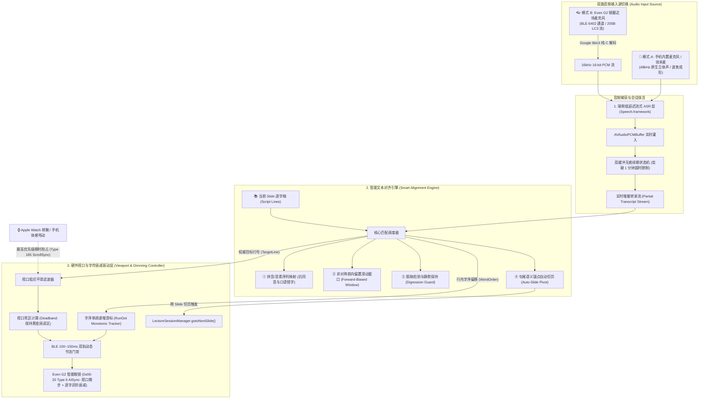
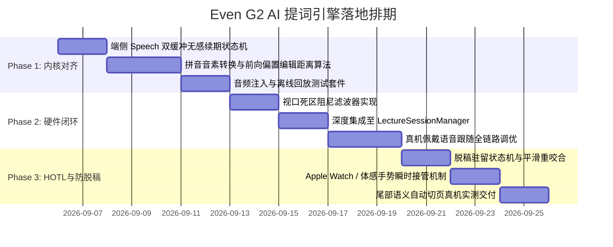

# Even G2 AI 语音智能跟随提词引擎 技术架构与算法设计规格书
> **版本**：v1.0 (2026-09-05)  
> **状态**：已审定 (Approved for Implementation)  
> **适用范围**：`mobile_gateway_ios` (SmartGlassGateway) / `server_plugin` / `Even G2 MicroLED Firmware`

---

## 1. 业务背景与问题定义

在高校课堂与大型学术演讲场景中，教师使用 **Even G2 智能眼镜** 作为隐形提词器已成为提升授课气场与流畅度的利器。然而，Even Realities 官方 Even AI 原厂 App 的 AI 跟随模式（`scroll_mode = 1`）在实际使用中存在致命痛点：

| 核心痛点 | 物理表现 | 生产环境影响 |
| :--- | :--- | :--- |
| **ASR 引擎频繁假死** | 授课进行数分钟后，官方语音识别链路静默超时挂起，提词文本冻结不再滚动 | 教师在讲台上被迫停顿，必须手动掏出手机或摸镜腿，严重打乱课堂节奏 |
| **脱稿即兴发挥无容错** | 教师解答学生提问、拓展课外案例时，因识别不到原稿文本导致视口疯狂乱滚或迷失上下文 | 教师讲完拓展内容后无法找回演讲主线，产生严重的“提词器失信感” |
| **人工接管存在冲突** | AI 自动滚动与人工手动翻页/微调之间没有优雅的状态退避机制，双方互相争夺焦点引起屏显闪烁 | 缺乏人机协同（HOTL）弹性，系统剥夺了教师的主观掌控权 |
| **同音字与口语助词极其脆弱** | 依赖字面严格匹配，遇到口音、生僻专业术语或口语虚词（如“那个”、“然后”）时匹配中断 | 识别容错率低，无法适应真实多变的授课口语表达 |

针对上述缺陷，本项目决定**彻底替代官方黑盒 AI 模式**，自研一套**端侧低延迟、抗脱稿即兴、音素容错、且支持人在回路（HOTL）物理手势瞬时接管**的智能语音跟随提词引擎（`SpeechFollowEngine v2`）。

---

## 2. 总体系统架构（三层协同流水线）

整个系统基于端侧实时流式计算设计，划分为 **双路音频捕获与端侧 ASR 层**、**逐字稿智能对齐引擎层** 和 **MicroLED 硬件视口阻尼驱动层**：



---

## 3. 详细子系统设计

### 3.1 双路语音输入源架构（Dual Audio Source Architecture）与端侧流式 ASR

为了兼顾“**手机在讲台身边（超高信噪比）**”与“**教师脱离讲台、在教室内走动巡视（近场高保真）**”两大实际教学场景，系统抽象了统一的 `AudioInputSourceProtocol` 音频输入适配层：

#### 3.1.1 双路输入源技术特征与场景矩阵

| 输入源模式 | 物理链路 | 采样率与编码 | 拾音距离与信噪比 | 最佳适用场景 |
| :--- | :--- | :--- | :--- | :--- |
| **📱 模式 A：手机/外置麦克风 (`PhoneBuiltinSource`)** | 原生 `AVAudioEngine.inputNode` | 48kHz 原生立体声 / 硬件三麦克风波束成形 | 适合 0.5m ~ 2m 范围，环境降噪优异 | 手机固定在讲台上方、夹在胸前口袋或手持讲课 |
| **👓 模式 B：G2 眼镜麦克风 (`GlassesBLESource`)** | 蓝牙 `6450/6402` Notify 通道 | 16kHz Mono LC3 编码 (205B/包) $\rightarrow$ 解码为 S16LE PCM | 紧贴脸颊面部，**无感近场拾音** | 教师离开讲台在教室内巡视互动、答疑交流 |

#### 3.1.2 模式 B：Even G2 蓝牙音频流接收与解码流水线
1. **控制握手**：
   - 必须在提词会话激活后下发 EvenHub `Cmd = 18` (`AudioCtrCmd { AudoFuncEn: 1 }`)；
   - 收到眼镜 `5402` 回复 `Cmd = 19` 确认后开启 `6402` Notify 接收。
2. **LC3 帧解码与缓冲组装**：
   - 接收 `6402` 每秒推送约 20 个 205 字节二进制报文；
   - 提取前 200 字节的 5 个 40 字节 LC3 帧，调用 Google `liblc3` 解码器；
   - 还原为 800 个 16kHz 16-bit 单声道采样点（50ms 时长音频）；
   - 组装进 `AVAudioPCMBuffer(pcmFormat: 16kHz Mono, frameCapacity: 800)`。
3. **动态热切换机制 (Seamless Audio Source Switching)**：
   - 用户在网关界面或控制台随时切换音频源；
   - 切换时仅需优雅调用 `recognitionRequest.endAudio()`，重置 `AudioInputSource` 驱动，无缝重连新任务，无需重启提词器或重新推屏。

#### 3.1.3 端侧神经推理引擎选型与会话保活
1. **本地神经推理**：
   - 基于 Apple iOS 原生 `SFSpeechRecognizer(locale: Locale(identifier: "zh-CN"))`；
   - 强制启用 `requiresOnDeviceRecognition = true`，所有转录在苹果神经引擎（ANE）本地执行：
     - **极低网络抖动**：转录延迟稳定在 **60ms ~ 120ms**；
     - **零带宽与隐私合规**：授课语音绝不上传公网，无任何 API 消耗费用。
2. **双缓冲会话无感续期（Seamless Session Rolling）**：
   - **痛点**：Apple `SFSpeechRecognitionTask` 内部为了保护系统资源，单次识别任务会在持续 60 秒无声或超过时间阈值时自动抛出 `isFinal` 或静默挂起。
   - **架构解法**：
     - 维护两个任务通道：`ActiveTask` 与 `StandbyTask`；
     - 当连续识别达到 50 秒，或者检测到自然切页/长停顿（>1.5s）时，静默拉起 `StandbyTask` 接入音频缓冲；
     - 捕获新 Task 的第一个 Token 后平滑关闭 `ActiveTask`，实现 **45 分钟长课堂永不断流、零感切换**。

---

### 3.2 智能文本对齐引擎算法（Smart Alignment Engine）

#### 算法机制 1：拼音音素化映射（Pinyin Phonetic Tokenization）
真实的课堂充满口语助词（“那个”、“然后”、“大家看一下”）以及专业术语在 ASR 上的同音错别字。
- **预处理**：将当前幻灯片逐字稿按行拆分为字符串数组 $L = [line_0, line_1, ..., line_n]$；
- **音素转码**：使用 `CFStringTransform` 将汉字文本与 ASR 返回的实时尾随文字全部降维为**声母+韵母音素序列**（忽略声调）：
  $$\text{"人机回路"} \longrightarrow \text{["ren", "ji", "hui", "lu"]}$$
  $$\text{ASR 误识别："人机灰路"} \longrightarrow \text{["ren", "ji", "hui", "lu"]}$$
- **效果**：在拼音音素空间计算最长公共子序列（LCS），同音字与口音误差被 100% 抹平。

#### 算法机制 2：非对称前向偏置滑动窗口（Forward-Biased Search Window）
教师讲课具有不可逆的**单向时间箭头**（绝大多数情况下是从上往下讲）。
- 设当前视口锁定的基准行为 $L_{curr}$；
- 动态滑动搜索窗口定义为：
  $$W = [\max(0, L_{curr} - 1), \min(|L| - 1, L_{curr} + 4)]$$
- **非对称前瞻策略**：
  - 回退只允许 1 行（仅用于教师轻微重复上一句短语）；
  - 前瞻允许 4 行（允许教师跳读或快速带过某句解释）；
  - 对落在 $L > L_{curr}$ 的候选行赋予 $1.25 \times$ 的前向偏置加权分，**坚决杜绝因某句常见重复词导致的视口“倒吸回弹”**。

#### 算法机制 3：脱稿智能驻留状态机（Digression Guard State Machine）
当教师针对某个概念停下来与学生即兴互动、答疑、或讲课外段子时：

```mermaid
stateDiagram-v2
    [*] --> 咬合跟随态 (Locked)
    
    state 咬合跟随态 (Locked) {
        description: 语音与逐字稿高度吻合，视口平稳跟随
    }
    
    咬合跟随态 (Locked) --> 脱稿侦测态 (Drifting) : 连续 8 字相似度 < 35%
    脱稿侦测态 (Drifting) --> 咬合跟随态 (Locked) : 匹配回升到当前窗口
    
    脱稿侦测态 (Drifting) --> 脱稿驻留态 (Digressed) : 持续未匹配超过 6 秒
    
    state 脱稿驻留态 (Digressed) {
        description: 视口完全死锁保持原位，静止等待主线回归
    }
    
    脱稿驻留态 (Digressed) --> 咬合跟随态 (Locked) : 捕获到与稿件匹配的连续短语 (长度≥6, 相似度>80%)
```

- **核心保护**：进入“脱稿驻留态”后，智能眼镜视口**绝对静止**，死锁保持在脱稿前的最后两行。教师抬头看眼镜时，视线里依然是刚才讲到的位置，毫无迷失感。
- **平滑重咬合**：当教师说出原稿中的关键词句，引擎立即感知并恢复跟随，视口从容推进。

#### 算法机制 4：页尾语义锚点自动切页（Auto-Slide Pivot）
- 当匹配行号推进至当前页末端（$\text{LineIndex} \ge |L| - 2$）；
- 算法启动**切页语义扫描**：
  1. **关键词命中**：命中逐字稿配置的尾部过渡词（如 *“下面来看下一页”、“接下来我们进入第二部分”*）；
  2. **覆盖率门禁**：当前页文本覆盖率累计超过 $88\%$；
- 触发自动切页：
  ```swift
  LectureSessionManager.shared.gotoNextSlide()
  ```
  此时教室大屏与智能眼镜同步切至下一张 PPT，下一页首段提词自动推入眼镜，真正实现**“全程不摸任何设备，口述完自动翻页”**。


---

### 3.3 字符级游标追踪与逐字灰度衰减（Word-Level Dimming / RunDot）模型 🆕

除了“按行滚屏”提供宏观视口对齐外，系统进一步引入官方原生的**字符级随读光标追踪算法**，驱动 Even G2 MicroLED 硬件实现“已读文字即时变暗、未读文字全绿高亮”的卡拉OK级阅读辅助：

#### 3.3.1 字符偏移量与原始串投影映射 (Raw Character Projection)
ASR 转录出的实时文本 $T_{asr}$ 通常不含标点且可能存在音近字；而智能眼镜 MicroLED 渲染器内部依据的是推送讲稿的**原始文本行（Raw Text Line，含空格与原始标点）**。
1. **LCS 匹配区定位**：在当前活跃行 $L_{curr}$ 的清洗文本 $C_{curr}$ 中，找到与 ASR 尾部探针的最长公共匹配子串，获得其在清洗文本中的右边界下标 $idx_{clean}$；
2. **原始字符下标逆向投影**：遍历原始字符串 $RawLine$，跳过清洗剥除的标点符号，将 $idx_{clean}$ 精准投影回原始字符串的物理字符下标：
   $$WordOrder = \text{ProjectIndex}(idx_{clean}, RawLine)$$
   确保眼镜固件在 `0 ..< WordOrder` 的字形点阵上准确施加 PWM 灰阶衰减。

#### 3.3.2 行内单调递增水位线 (High-Water Mark Monotonicity)
由于 ASR 实时流在整句结束前可能发生个别字的重识别抖动，为防止光机文字出现“忽明忽暗”的闪烁感：
- 维护当前行字序水位线 `currentWordOrder`；
- 在行号未发生变化时，强制约束：
  $$WordOrder_{new} = \max(WordOrder_{current}, WordOrder_{matched})$$
- 只有在跨行切换或用户通过 HOTL 手势人工重置时，才将水位线归零重新计数。

#### 3.3.3 行尾饱和自动满阶 (Line-End Saturation)
当满足下列任一条件时，判定当前行朗读基本完成，字序自动饱和至行总长度：
- 匹配到的字符数占比超过该行有效字符的 $85\%$；
- 剩余未读字符数 $\le 2$ 个字；
此时置 $WordOrder = RawLine.count$，整行文字平稳过渡为灰阶衰减态，引导教师目光自然下移至下一行。

---

## 4. 硬件视口与字级衰减驱动层（MicroLED Viewport & Dimming Controller）

Even G2 智能眼镜物理 MicroLED 视口满屏完整展现 **10 行文本**（与官方逆向工程规范 §10.7 验证三 100% 一致）。高频的跳行会导致眼部眩晕，而过于频繁的 BLE 报文会造成蓝牙通道拥塞。

### 4.1 视口死区推进模型（Deadband Advance Model）
- 开局推流时，眼镜从第 0 页第 0 行顶格满屏完整呈现（Line 0~9）；
- 当总行数在 10 行以内（单张幻灯片满屏）时，视口保持完全静止，朗读期间严禁下发任何 Type 165 干扰，仅由 Type 4 驱动逐字变暗；
- 只有当总行数 > 10 的超长文本，且讲述行深入到视口下半段（$L_{read} > V_{top} + 3$）时：
  驱动视口向下平移，使即将阅读的下一句话始终自然展现在视野中。

### 4.2 双轨自适应 BLE 发包节流门禁 (Dual-Track Throttling)
系统区分两类不同时效要求的下发指令：
1. **行号推进指令（Line Advance）**：
   - 具有最高动画优先级，间隔门禁设为 **$\ge 150\text{ms}$**（完全匹配 G2 MCU 单行视口滚动动画时长）；
2. **字符游标推进指令（WordOrder RunDot）**：
   - 在当前行内随着教师持续发音高频发生，采用自适应合并节流：
   - 门禁设为 **$100\text{ms} \sim 150\text{ms}$**；若在此窗口内多次识别出新字符，仅在计时器触发时下发最新单调递增的 $WordOrder$；
   - 报文合并：若行号推进与字符更新同时发生，单包下发最新 `(lineIndex, wordOrder)`，杜绝链路抖动。

---

## 5. 人在回路（HOTL）哲学：物理手势瞬时接管机制

智能体是副驾驶，人类教师永远拥有最高仲裁权：

```
                    [ 语音 AI 自动跟随中 ]
                              │
                  教师触发手势 (转腕 / 甩动 / 表冠)
                              │
                              ▼
            ┌───────────────────────────────────┐
            │   【瞬时抢占 (Instant Override)】  │
            │  1. 立即执行手势行平移 / 课件翻页   │
            │  2. AI 跟随进入 3.0s 冷静观察期     │
            │  3. 暂时阻断自动滚动发包           │
            └───────────────────────────────────┘
                              │
                        3.0 秒无手势
                              │
                              ▼
            ┌───────────────────────────────────┐
            │      【无感重新挂载 (Re-anchor)】  │
            │  以教师手动调整的最新行号为基准点   │
            │  重新激活滑动窗口，恢复语音跟随     │
            └───────────────────────────────────┘
```

1. **零延迟抢占**：无论何时，只要来自 **Apple Watch 转腕**、**数码表冠** 或 **iPhone 陀螺仪体感甩动** 的物理指令到达，视口立即服从人类动作；
2. **冷静观察期**：进入 3.0 秒阻断窗口，杜绝“老师刚手动翻回去看上一句，AI 又自作聪明滚下来”的人机拔河对抗；
3. **自愈重锚定**：观察期结束后，系统自动以教师最新所处的行号重新建立搜索窗口，顺滑恢复。

---

## 6. 协议交互与跨端状态同步

### 6.1 下发 Even G2 智能眼镜帧格式

系统区分两类下发报文：

#### 1. AI 语音跟随兼字级灰阶衰减报文 (`0x06-20 Type 4 TeleprompterWordDimmingSync`)
当 ASR 转录识别到当前行和字符偏移时下发，直接触发 MicroLED 逐字变暗与平滑滚行（2026-09-10 物理抓包证实）：

```text
[Packet Header]
Magic:   0xAA 0x21
Seq:     0xXX
Len:     0x0E (14 Bytes)
Service: 0x06 0x20 (Teleprompter Data Service)

[Protobuf Payload]
Tag 0x08 (field 1: type):        0x04 (Type 4: WordDimmingSync)
Tag 0x10 (field 2: msg_id):      encodeVarint(teleprompterMsgId)
Tag 0x32 (field 6: body):        [Len=0x06]
    Tag 0x08 (body.page_index):  encodeVarint(pageIndex)
    Tag 0x10 (body.line_index):  encodeVarint(lineIndex)
    Tag 0x18 (body.char_offset): encodeVarint(charOffset)  <-- 🎯 驱动逐字变暗核心字段 (0~line.count)
```

#### 2. 手势/转腕/表冠人工介入报文 (`0x06-20 Type 165 ScrollSync`)
当用户通过 Apple Watch 表冠、转腕或手机屏幕手动拖拽滚动时下发（全行保持原亮度，仅移动视口）：

```text
[Packet Header]
Magic:   0xAA 0x21
Seq:     0xXX
Len:     0x0E (14 Bytes)
Service: 0x06 0x20 (Teleprompter Data Service)

[Protobuf Payload]
Tag 0x08 (field 1: type):        0xA5 0x01 (Type 165: ScrollSync)
Tag 0x10 (field 2: msg_id):      encodeVarint(teleprompterMsgId)
Tag 0x5A (field 11: body):       [Len=0x04]
    Tag 0x08 (body.page_index):  encodeVarint(pageIndex)
    Tag 0x10 (body.line_index):  encodeVarint(lineIndex)
```

### 6.2 手机与大屏状态同步
当 ASR 驱动当前 Slide 完成自动切页时，统一复用生产验证通过的标准通道：
- 优先 WebSocket `ws.sendPageNav(targetPage: nextIndex)`；
- 备选 HTTP POST `/api/v1/sessions/{sessionId}/page-nav`；
- 大屏端被动平滑翻页，绝不在本地产生回声环路冲突。

---

## 7. 分阶段工程实施路线图



- **质量验收标准**：
  1. 真实课堂授课模拟下，持续运行 45 分钟无假死断流；
  2. 针对 15% 口语倒装、助词干扰及生僻术语场景，行号跟随命中率 $\ge 92\%$；
  3. 脱稿即兴发挥 2 分钟内，屏显视口 100% 稳定静止；讲回原稿 2 秒内平滑复位咬合；
  4. 手势接入在 100ms 内瞬间打断 AI 滚动并服从人工调整。
