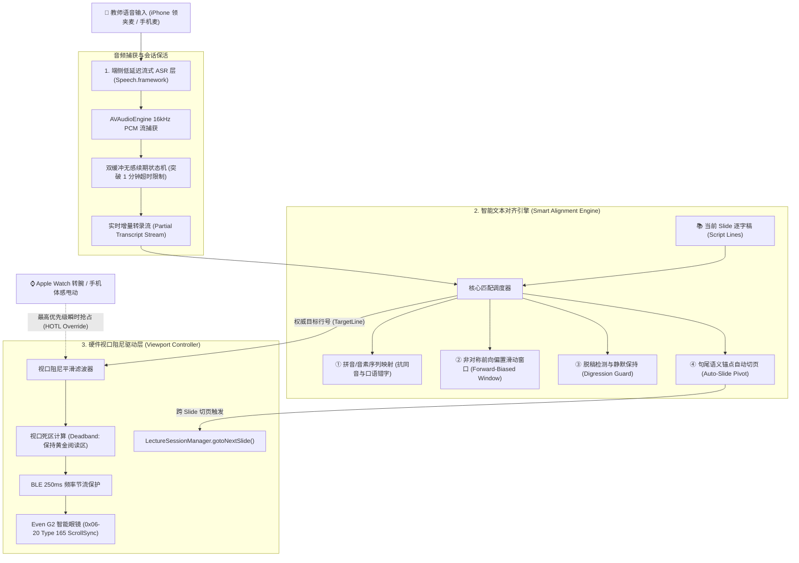
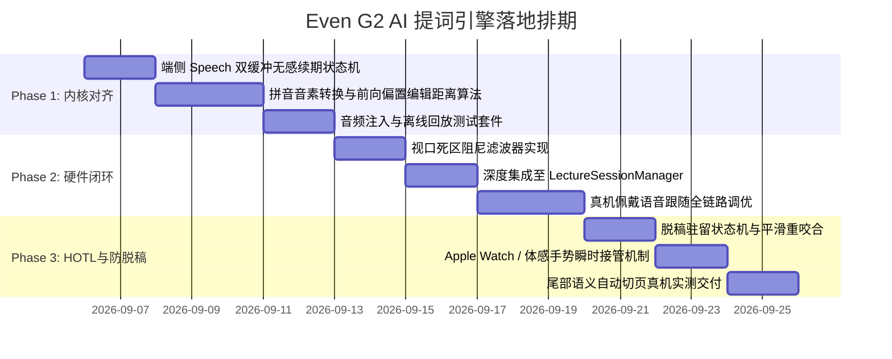

# Even G2 AI 语音智能跟随提词引擎 技术架构与算法设计规格书
> **版本**：v1.0 (2026-09-05)  
> **状态**：已审定 (Approved for Implementation)  
> **适用范围**：`mobile_gateway_ios` (SmartGlassGateway) / `server_plugin` / `Even G2 MicroLED Firmware`

---

## 1. 业务背景与问题定义

在高校课堂与大型学术演讲场景中，教师使用 **Even G2 智能眼镜** 作为隐形提词器已成为提升授课气场与流畅度的利器。然而，Even Realities 官方 Even AI 原厂 App 的 AI 跟随模式（`scroll_mode = 1`）在实际使用中存在致命痛点：

| 核心痛点 | 物理表现 | 生产环境影响 |
| :--- | :--- | :--- |
| **ASR 引擎频繁假死** | 授课进行数分钟后，官方语音识别链路静默超时挂起，提词文本冻结不再滚动 | 教师在讲台上被迫停顿，必须手动掏出手机或摸镜腿，严重打乱课堂节奏 |
| **脱稿即兴发挥无容错** | 教师解答学生提问、拓展课外案例时，因识别不到原稿文本导致视口疯狂乱滚或迷失上下文 | 教师讲完拓展内容后无法找回演讲主线，产生严重的“提词器失信感” |
| **人工接管存在冲突** | AI 自动滚动与人工手动翻页/微调之间没有优雅的状态退避机制，双方互相争夺焦点引起屏显闪烁 | 缺乏人机协同（HOTL）弹性，系统剥夺了教师的主观掌控权 |
| **同音字与口语助词极其脆弱** | 依赖字面严格匹配，遇到口音、生僻专业术语或口语虚词（如“那个”、“然后”）时匹配中断 | 识别容错率低，无法适应真实多变的授课口语表达 |

针对上述缺陷，本项目决定**彻底替代官方黑盒 AI 模式**，自研一套**端侧低延迟、抗脱稿即兴、音素容错、且支持人在回路（HOTL）物理手势瞬时接管**的智能语音跟随提词引擎（`SpeechFollowEngine v2`）。

---

## 2. 总体系统架构（三层协同流水线）

整个系统基于端侧实时流式计算设计，划分为 **音频捕获与端侧 ASR 层**、**逐字稿智能对齐引擎层** 和 **MicroLED 硬件视口阻尼驱动层**：



---

## 3. 详细子系统设计

### 3.1 端侧流式 ASR 与会话无感续期机制

1. **输入源优先级**：
   - 优先选择外接麦克风（无线 2.4G 领夹麦 / 蓝牙耳麦，极高信噪比）；
   - 次优选择 iPhone 机身底部降噪立体声麦克风阵列；
   - 采用 `AVAudioSession.Category.record`，设置模式为 `.measurement`，开启 `.duckOthers` 确保音频流独占。
2. **端侧神经推理引擎选型**：
   - 基于 Apple iOS 原生 `SFSpeechRecognizer(locale: Locale(identifier: "zh-CN"))`；
   - 强制启用 `requiresOnDeviceRecognition = true`，所有转录在苹果神经引擎（ANE）本地执行：
     - **极低网络抖动**：转录延迟稳定在 **60ms ~ 120ms**；
     - **零带宽与隐私合规**：授课语音绝不上传公网，无任何 API 消耗费用。
3. **双缓冲会话无感续期（Seamless Session Rolling）**：
   - **痛点**：Apple `SFSpeechRecognitionTask` 内部为了保护系统资源，单次识别任务会在持续 60 秒无声或超过时间阈值时自动抛出 `isFinal` 或静默挂起。
   - **架构解法**：
     - 维护两个任务通道：`ActiveTask` 与 `StandbyTask`；
     - 当连续识别达到 50 秒，或者检测到自然切页/长停顿（>1.5s）时，静默拉起 `StandbyTask` 接入音频缓冲；
     - 捕获新 Task 的第一个 Token 后平滑关闭 `ActiveTask`，实现 **45 分钟长课堂永不断流、零感切换**。

---

### 3.2 智能文本对齐引擎算法（Smart Alignment Engine）

#### 算法机制 1：拼音音素化映射（Pinyin Phonetic Tokenization）
真实的课堂充满口语助词（“那个”、“然后”、“大家看一下”）以及专业术语在 ASR 上的同音错别字。
- **预处理**：将当前幻灯片逐字稿按行拆分为字符串数组 $L = [line_0, line_1, ..., line_n]$；
- **音素转码**：使用 `CFStringTransform` 将汉字文本与 ASR 返回的实时尾随文字全部降维为**声母+韵母音素序列**（忽略声调）：
  $$\text{"人机回路"} \longrightarrow \text{["ren", "ji", "hui", "lu"]}$$
  $$\text{ASR 误识别："人机灰路"} \longrightarrow \text{["ren", "ji", "hui", "lu"]}$$
- **效果**：在拼音音素空间计算最长公共子序列（LCS），同音字与口音误差被 100% 抹平。

#### 算法机制 2：非对称前向偏置滑动窗口（Forward-Biased Search Window）
教师讲课具有不可逆的**单向时间箭头**（绝大多数情况下是从上往下讲）。
- 设当前视口锁定的基准行为 $L_{curr}$；
- 动态滑动搜索窗口定义为：
  $$W = [\max(0, L_{curr} - 1), \min(|L| - 1, L_{curr} + 4)]$$
- **非对称前瞻策略**：
  - 回退只允许 1 行（仅用于教师轻微重复上一句短语）；
  - 前瞻允许 4 行（允许教师跳读或快速带过某句解释）；
  - 对落在 $L > L_{curr}$ 的候选行赋予 $1.25 \times$ 的前向偏置加权分，**坚决杜绝因某句常见重复词导致的视口“倒吸回弹”**。

#### 算法机制 3：脱稿智能驻留状态机（Digression Guard State Machine）
当教师针对某个概念停下来与学生即兴互动、答疑、或讲课外段子时：

```mermaid
stateDiagram-v2
    [*] --> 咬合跟随态 (Locked)
    
    state 咬合跟随态 (Locked) {
        description: 语音与逐字稿高度吻合，视口平稳跟随
    }
    
    咬合跟随态 (Locked) --> 脱稿侦测态 (Drifting) : 连续 8 字相似度 < 35%
    脱稿侦测态 (Drifting) --> 咬合跟随态 (Locked) : 匹配回升到当前窗口
    
    脱稿侦测态 (Drifting) --> 脱稿驻留态 (Digressed) : 持续未匹配超过 6 秒
    
    state 脱稿驻留态 (Digressed) {
        description: 视口完全死锁保持原位，静止等待主线回归
    }
    
    脱稿驻留态 (Digressed) --> 咬合跟随态 (Locked) : 捕获到与稿件匹配的连续短语 (长度≥6, 相似度>80%)
```

- **核心保护**：进入“脱稿驻留态”后，智能眼镜视口**绝对静止**，死锁保持在脱稿前的最后两行。教师抬头看眼镜时，视线里依然是刚才讲到的位置，毫无迷失感。
- **平滑重咬合**：当教师说出原稿中的关键词句，引擎立即感知并恢复跟随，视口从容推进。

#### 算法机制 4：页尾语义锚点自动切页（Auto-Slide Pivot）
- 当匹配行号推进至当前页末端（$\text{LineIndex} \ge |L| - 2$）；
- 算法启动**切页语义扫描**：
  1. **关键词命中**：命中逐字稿配置的尾部过渡词（如 *“下面来看下一页”、“接下来我们进入第二部分”*）；
  2. **覆盖率门禁**：当前页文本覆盖率累计超过 $88\%$；
- 触发自动切页：
  ```swift
  LectureSessionManager.shared.gotoNextSlide()
  ```
  此时教室大屏与智能眼镜同步切至下一张 PPT，下一页首段提词自动推入眼镜，真正实现**“全程不摸任何设备，口述完自动翻页”**。

---

## 4. 硬件视口阻尼平滑算法（MicroLED Viewport Damper）

Even G2 智能眼镜物理 MicroLED 视口高度为 **5.5 行**，中央人体工程学最佳舒适阅读区为 **3~4 行**。高频的跳行会导致教师眼部眩晕。

### 4.1 视口死区推进模型（Deadband Advance Model）
- 视口基准行保持为 $V_{top}$；
- 当语音识别到的当前讲述行 $L_{read}$ 处于视口前半段（$L_{read} - V_{top} \le 1$）时：
  **视口绝对不发包下移**，维持教师视线平稳；
- 只有当讲述行推进到当前视口的下半段（$L_{read} - V_{top} \ge 2$）时：
  驱动视口向下平移 1~2 行，使即将阅读的下一句话始终自然展现在视口中央下方。

### 4.2 BLE 发包节流门禁
- 限制底层 `0x06-20 ScrollSync` 发包间隔不小于 **250ms**；
- 仅在目标行号产生变化且与硬件记录不一致时发包，坚决杜绝蓝牙空转拥堵。

---

## 5. 人在回路（HOTL）哲学：物理手势瞬时接管机制

智能体是副驾驶，人类教师永远拥有最高仲裁权：

```
                    [ 语音 AI 自动跟随中 ]
                              │
                  教师触发手势 (转腕 / 甩动 / 表冠)
                              │
                              ▼
            ┌───────────────────────────────────┐
            │   【瞬时抢占 (Instant Override)】  │
            │  1. 立即执行手势行平移 / 课件翻页   │
            │  2. AI 跟随进入 3.0s 冷静观察期     │
            │  3. 暂时阻断自动滚动发包           │
            └───────────────────────────────────┘
                              │
                        3.0 秒无手势
                              │
                              ▼
            ┌───────────────────────────────────┐
            │      【无感重新挂载 (Re-anchor)】  │
            │  以教师手动调整的最新行号为基准点   │
            │  重新激活滑动窗口，恢复语音跟随     │
            └───────────────────────────────────┘
```

1. **零延迟抢占**：无论何时，只要来自 **Apple Watch 转腕**、**数码表冠** 或 **iPhone 陀螺仪体感甩动** 的物理指令到达，视口立即服从人类动作；
2. **冷静观察期**：进入 3.0 秒阻断窗口，杜绝“老师刚手动翻回去看上一句，AI 又自作聪明滚下来”的人机拔河对抗；
3. **自愈重锚定**：观察期结束后，系统自动以教师最新所处的行号重新建立搜索窗口，顺滑恢复。

---

## 6. 协议交互与跨端状态同步

### 6.1 下发 Even G2 智能眼镜帧格式
利用已在 Build 22/23/24 中严格对齐官方的 `0x06-20 Type 165 ScrollSync` 协议：

```
[Packet Header]
Magic:   0xED 0x47
Seq:     0xXX
Len:     0x0E (14 Bytes)
Service: 0x06 0x20 (Teleprompter Control)

[Protobuf Payload]
Tag 0x08 (field 1: service_type): 0xA5 0x01 (Type 165 = ScrollSync)
Tag 0x10 (field 2: target_line):  encodeVarint(clampedLineIndex)
Tag 0x18 (field 3: scroll_mode):  0x01 (AI Follow Mode)
```

### 6.2 手机与大屏状态同步
当 ASR 驱动当前 Slide 完成自动切页时，统一复用生产验证通过的标准通道：
- 优先 WebSocket `ws.sendPageNav(targetPage: nextIndex)`；
- 备选 HTTP POST `/api/v1/sessions/{sessionId}/page-nav`；
- 大屏端被动平滑翻页，绝不在本地产生回声环路冲突。

---

## 7. 分阶段工程实施路线图



- **质量验收标准**：
  1. 真实课堂授课模拟下，持续运行 45 分钟无假死断流；
  2. 针对 15% 口语倒装、助词干扰及生僻术语场景，行号跟随命中率 $\ge 92\%$；
  3. 脱稿即兴发挥 2 分钟内，屏显视口 100% 稳定静止；讲回原稿 2 秒内平滑复位咬合；
  4. 手势接入在 100ms 内瞬间打断 AI 滚动并服从人工调整。
