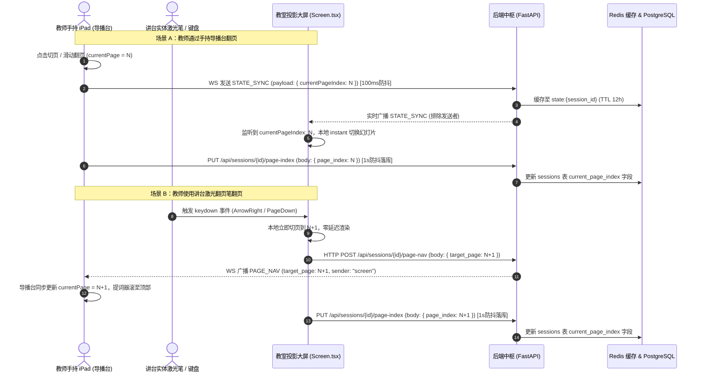

# 智慧课堂课件翻页控制与双向联动协议规范 (Slide Navigation Protocol)

> **版本**: v1.0  
> **更新日期**: 2026-09-03  
> **适用范围**: `smart-class-director` (导播台/大屏端) ↔ `smart-class-backend` (FastAPI 交互中枢)  
> **关联文档**: [API_DOCUMENTATION.md](API_DOCUMENTATION.md) | [WebSocket_Protocol.md](WebSocket_Protocol.md) | [Frontend_Architecture.md](Frontend_Architecture.md)

---

## 1. 架构与设计总览

智慧课堂的课件演示系统采用 **“主控导播台 (Master) + 沉浸式展示大屏 (Slave)”** 的双生形态。为了满足课堂教学中复杂的教学走位与设备操作习惯，翻页系统采用了**双通道双向联动闭环机制**：

```
                    ┌────────────────────────┐
                    │ 导播台 (iPad / 教师端)  │
                    │      (App.tsx)         │
                    └───────────┬────────────┘
                                │ 1. WS STATE_SYNC (100ms 防抖)
                                │ 2. PUT page-index (1s 防抖持久化)
                                ▼
                    ┌────────────────────────┐
                    │  smart-class-backend   │
                    │  (FastAPI + Redis + DB)│
                    └───────────▲────────────┘
                                │ 3. WS/SSE 实时广播推送
                                │ 4. POST page-nav (激光笔反向通知)
                                │ 5. PUT page-index (1s 防抖持久化)
                                ▼
                    ┌────────────────────────┐
                    │ 投影大屏 (大屏幕展示端)  │
                    │     (Screen.tsx)       │
                    └────────────────────────┘
                                ▲
                       [实体激光翻页笔 / 键盘]
```

### 核心设计原则

1. **双向无缝联动**：
   - **正向控制**：教师在 iPad 导播台点击上一页/下一页或缩略图，大屏端即时响应渲染对应页。
   - **反向控制**：教师在讲台使用**实体激光翻页笔**或键盘（`PageDown`/`ArrowRight`/`Space`）直接操作大屏电脑时，大屏不仅本地瞬时切页，还会反向通知导播台，使教师手持端的**提词器逐字稿自动滚动对齐**。
2. **零延迟本地渲染 (Phase 2)**：
   - 大屏端与导播台均在本地加载并解析完整课件 Markdown；
   - 网络信道**仅传输轻量页码索引（`currentPageIndex`）与控制指令**，彻底规避传输数十 KB Marp HTML 导致的卡顿与内存泄漏。
3. **分层防抖与断点续讲**：
   - **实时层（毫秒级）**：WebSocket 状态同步内置 **100ms 防抖**，支持快速滑动浏览；
   - **缓存层（秒级）**：Redis `state:{session_id}` 缓存最新页码（TTL 12 小时），大屏刷新或断网重连自愈；
   - **持久化层（落库）**：两端翻页内置 **1 秒防抖**，确认停留在某页后才异步写入数据库 `sessions.current_page_index`，下节课重进可直接恢复进度。

---

## 2. 完整时序交互流程



---

## 3. 实时通信协议接口 (WebSocket & SSE)

### 3.1 导播台下发状态同步：`STATE_SYNC`

* **信道协议**：WebSocket (`/smart-class/ws/session/{session_id}`)
* **方向**：Presenter (导播台) $\rightarrow$ Backend $\rightarrow$ Broadcast (排除发送者)
* **适用场景**：导播台切页、切换演示模式、下发当前页关联的二维码指令等。
* **消息格式**：
  ```json
  {
    "type": "STATE_SYNC",
    "sender": "presenter",
    "payload": {
      "currentPageIndex": 5,
      "totalSlides": 28,
      "qrContent": "https://example.com/checkin"
    }
  }
  ```
* **字段说明**：
  | 字段 | 类型 | 必填 | 说明 |
  | :--- | :--- | :--- | :--- |
  | `type` | string | 是 | 固定值 `"STATE_SYNC"` |
  | `sender` | string | 否 | 发送者角色，固定为 `"presenter"` |
  | `payload.currentPageIndex` | integer | 是 | 当前幻灯片页码（**0-based 索引**，0 代表第 1 页） |
  | `payload.totalSlides` | integer | 否 | 幻灯片总页数 |
  | `payload.qrContent` | string | 否 | 该页若配置了二维码指令时的动态展示 URL |

---

### 3.2 通用翻页指令：`PAGE_NAV`

* **信道协议**：WebSocket (`/smart-class/ws/session/{session_id}`)
* **方向**：Screen / Server $\rightarrow$ Broadcast
* **适用场景**：大屏端翻页笔触发后、或服务端主动命令所有端跳页时广播。
* **消息格式**：
  ```json
  {
    "type": "PAGE_NAV",
    "target_page": 6,
    "sender": "screen"
  }
  ```
* **字段说明**：
  | 字段 | 类型 | 必填 | 说明 |
  | :--- | :--- | :--- | :--- |
  | `type` | string | 是 | 固定值 `"PAGE_NAV"` |
  | `target_page` | integer | 是 | 目标跳转页码（0-based 索引） |
  | `sender` | string | 否 | 发起方标识，通常为 `"screen"` |

---

### 3.3 大屏断线首帧状态对齐：`SSE Stream`

* **信道协议**：Server-Sent Events (`GET /smart-class/api/sessions/{session_id}/stream`)
* **适用场景**：大屏端页面刷新或断线重连。
* **机制**：大屏刚建立 SSE 连接后，后端会立即取出 Redis 中的 `state:{session_id}` 缓存，向客户端输出第一帧数据，使大屏无需等待导播台下一次操作即可瞬间恢复到当前页码。
* **消息示例**：
  ```http
  data: {"type": "STATE_SYNC", "sender": "presenter", "payload": {"currentPageIndex": 5, "totalSlides": 28}}
  ```

---

## 4. HTTP RESTful 接口规范

### 4.1 大屏反向翻页通知 (POST Page Nav)

大屏键盘或激光笔触发翻页时，反向通知导播台的控制通道。

* **接口路径**: `POST /smart-class/api/sessions/{session_id}/page-nav`
* **认证方式**: 公开（大屏端无状态运行）
* **Content-Type**: `application/json`

#### 请求参数 (Request Body)
```json
{
  "target_page": 5
}
```
| 字段 | 类型 | 必填 | 约束 | 说明 |
| :--- | :--- | :--- | :--- | :--- |
| `target_page` | integer | 是 | $\ge 0$ | 目标幻灯片页码（0-based） |

#### 响应参数 (Response 200)
```json
{
  "ok": true
}
```

---

### 4.2 课时播放页码持久化 (PUT Page Index)

将播放进度固化到数据库，用于断点续讲与课程档案管理。

* **接口路径**: `PUT /smart-class/api/sessions/{session_id}/page-index`
* **认证方式**: `Authorization: Bearer <token>`（教师/管理员）
* **Content-Type**: `application/json`

#### 请求参数 (Request Body)
```json
{
  "page_index": 5
}
```
| 字段 | 类型 | 必填 | 说明 |
| :--- | :--- | :--- | :--- |
| `page_index` | integer | 是 | 当前停留页码索引（0-based） |

#### 响应参数 (Response 200)
```json
{
  "ok": true
}
```

#### 数据库持久化映射
* **存储表**: `sessions`
* **更新字段**: `current_page_index = :page_index`
* **防抖策略**: 前端组件（`App.tsx` 与 `Screen.tsx`）均内置了 **1000ms 定时器防抖**。连续快速按键跳页时仅最后停留的页面会触发 HTTP PUT，保护数据库连接池。

---

### 4.3 课件加载与历史进度读取 (GET Courseware)

当大屏或导播台初次挂载加载课件时调用。

* **接口路径**: `GET /smart-class/api/sessions/{session_id}/courseware`
* **认证方式**: 可选 Bearer JWT
* **响应参数关键字段 (Response 200)**:
  ```json
  {
    "markdown": "# 课件内容...",
    "saved_page_index": 5,
    "image_base_url": "http://...",
    "images": []
  }
  ```
* **前端消费逻辑**:
  - `Screen.tsx` 读取到 `saved_page_index` 后，若本地未接收到实时状态，则默认跳转至 `saved_page_index`；
  - 导播台 `App.tsx` 同步以此页码为基准初始化提词器。

---

### 4.4 课时剧本与逐字稿读取 (GET Session Info)

**导播台大字号提词器获取演讲逐字稿的核心接口**。导播台挂载时必须调用此接口获取完整的剧本 Markdown、服务端预解析的结构化剧本数据以及历史进度。

* **接口路径**: `GET /smart-class/api/sessions/{session_id}/info`
* **认证方式**: `Authorization: Bearer <token>`（教师/管理员）
* **Content-Type**: `application/json`

#### 响应参数 (Response 200)
```json
{
  "session_id": "abc12345",
  "is_owner": true,
  "owner_id": "004475",
  "course_name": "软件工程 2026 春",
  "course_id": 5,
  "session_name": "第5周-意图驱动编程",
  "phase": "IDLE",
  "script": "# 课件标题\n\n---\n\n## 第一页幻灯片\n\n:::playbook\n同学们好，欢迎进入今天的课程！(Visual: @focus #hero-card)\n:::\n",
  "playbook_data": {
    "segments": [
      {
        "id": "seg_0_0",
        "text": "同学们好，欢迎进入今天的课程！",
        "slide_index": 0
      }
    ],
    "visual_actions": [
      {
        "action": "focus",
        "target": "#hero-card",
        "slide_index": 0
      }
    ]
  },
  "image_base_url": "/smart-class/static/session-images/abc12345",
  "current_page_index": 3
}
```

#### 关键字段说明
| 字段 | 类型 | 说明 |
| :--- | :--- | :--- |
| `script` | string | 课时完整原始 Markdown 文本，包含幻灯片排版与内嵌的逐字稿语法块 |
| `playbook_data` | object | 服务端 `PlaybookParser` 预解析的结构化数据，包含供数字人/TTS 生成的纯语音文本片段 (`segments`) 与前端特效指令 (`visual_actions`) |
| `current_page_index` | integer | 当前课时持久化在数据库中的进度页码（0-based） |
| `image_base_url` | string | 该课时静态资源与图片的相对前缀路径 |

#### 逐字稿语法规范与提词器联动
导播台前端在获取到 `info.script` 后，交由 [Courseware/parser.ts](file:///Users/l.ylive.cn/OneDrive/NCU-AI-Educators/smart-course-platform/smart-class-director/src/components/Courseware/parser.ts) 执行逐页切片与解析：

1. **逐字稿标记语法**：
   - **推荐规范 (Playbook 语法块)**：
     ```markdown
     :::playbook
     这里是教师口述逐字稿内容。(Visual: @focus #step-1) [Break: 0.5s]
     下面我们进入下一环节演示。
     :::
     ```
     *前端解析器会自动剔除 `(Visual: ...)` 视觉指令与 `[Break: ...]` 停顿标签，提取纯净文本作为演讲口述稿。*
   - **经典规范 (Script 语法块)**：
     ```markdown
     :::script
     这里是该张幻灯片的教师备课台词与演讲指引。
     :::
     ```
2. **提词器翻页联动机制**：
   - 导播台提取出每页的 `SlidePage.script`；
   - 当翻页触发（无论源于导播台点击还是大屏激光翻页笔触发），`currentPage` 更新；
   - 提词器容器（`scriptScrollRef`）**自动重置滚动条位置至顶部 (`scrollTop = 0`)**；
   - 界面使用 `marked.parse` 以响应式特大字号（`text-5xl font-medium leading-[1.4]`）渲染该页口述内容，支持触屏左右滑动手势切页。

---

### 4.5 课时剧本热更新保存 (PUT Session Script)

允许教师在导播台或可视编辑器中实时微调修改课件与逐字稿内容并热保存。

* **接口路径**: `PUT /smart-class/api/sessions/{session_id}/script`
* **认证方式**: `Authorization: Bearer <token>`（教师/管理员）
* **Content-Type**: `application/json`

#### 请求参数 (Request Body)
```json
{
  "script": "# 完整更新后的 Markdown 课件与逐字稿全文..."
}
```

#### 响应参数 (Response 200)
```json
{
  "ok": true
}
```

---

## 5. 前端核心组件调用索引

| 业务角色 | 源码位置 | 对应翻页与逐字稿逻辑 |
| :--- | :--- | :--- |
| **导播台 (Master)** | [smart-class-director/src/App.tsx](file:///Users/l.ylive.cn/OneDrive/NCU-AI-Educators/smart-course-platform/smart-class-director/src/App.tsx) | • 调用 `GET /info` 获取 `script` 逐字稿与历史页码<br/>• `handlePageNav(targetPage)`: 接收大屏切页通知<br/>• `syncSlideToScreen(index)`: 触发 WebSocket 广播与提词器联动<br/>• `scriptScrollRef`: 翻页时逐字稿容器自动滚回顶部 (`scrollTop = 0`)<br/>• `useEffect` (1s 防抖): 调用 `PUT /page-index` 落库 |
| **展示大屏 (Slave)** | [smart-class-director/src/Screen.tsx](file:///Users/l.ylive.cn/OneDrive/NCU-AI-Educators/smart-course-platform/smart-class-director/src/Screen.tsx) | • 调用 `GET /courseware` 获取课件 Markdown 与图片清单<br/>• 键盘事件监听器 (`ArrowRight`, `PageDown`, `Space` 等)<br/>• `sendPageNav(targetPage)`: 调用 `POST /page-nav` 反向通知<br/>• `useEffect` (1s 防抖): 兜底调用 `PUT /page-index` |
| **逐字稿解析器** | [smart-class-director/src/components/Courseware/parser.ts](file:///Users/l.ylive.cn/OneDrive/NCU-AI-Educators/smart-course-platform/smart-class-director/src/components/Courseware/parser.ts) | • `parseCourseware`: 提取 `:::playbook` / `:::script` 块为逐字稿<br/>• 自动过滤 Visual 指令与 Timing 标记 |
| **通信层 Hook** | [smart-class-director/src/hooks/useClassroomSync.ts](file:///Users/l.ylive.cn/OneDrive/NCU-AI-Educators/smart-course-platform/smart-class-director/src/hooks/useClassroomSync.ts) | • `updateState`: 内置 100ms 防抖合并高频 `STATE_SYNC`<br/>• `sendPageNav`: 发送 WebSocket 原生 `PAGE_NAV` |
| **后端剧本解析器** | [smart-class-backend/managers/playbook.py](file:///Users/l.ylive.cn/OneDrive/NCU-AI-Educators/smart-course-platform/smart-class-backend/managers/playbook.py) | • `PlaybookParser.parse_markdown`: 提取语音分段与前端视觉行为 |
| **后端反向通知** | [smart-class-backend/routers/sse.py](file:///Users/l.ylive.cn/OneDrive/NCU-AI-Educators/smart-course-platform/smart-class-backend/routers/sse.py) | • 接收 `POST /api/sessions/{session_id}/page-nav` 并执行房间广播 |
| **后端课时与剧本服务** | [smart-class-backend/routers/session.py](file:///Users/l.ylive.cn/OneDrive/NCU-AI-Educators/smart-course-platform/smart-class-backend/routers/session.py) | • `GET /api/sessions/{id}/info`: 返回剧本、逐字稿与进度<br/>• `PUT /api/sessions/{id}/page-index`: 处理页码持久化<br/>• `PUT /api/sessions/{id}/script`: 处理剧本内容热更新 |

---

## 6. 常见故障排查与运维指南

### 6.1 症状：大屏画面停滞，不跟随导播台翻页
1. **排查 WebSocket 状态**：
   - 检查导播台右上角网络指示灯是否为绿色；
   - 打开浏览器开发者工具，检查 `ws://<host>/smart-class/ws/session/{session_id}` 是否处于 `101 Switching Protocols`。
2. **检查 Redis 服务与 Pub/Sub**：
   - 登录服务器运行 `docker exec -it smart-course-redis redis-cli ping` 确认正常；
   - 检查 Redis 键 `state:{session_id}` 是否有最新值。
3. **检查 Nginx WebSocket 代理配置**：
   - 确认 `nginx.conf` 中包含 `proxy_set_header Upgrade $http_upgrade;` 与 `proxy_set_header Connection "upgrade";`。

### 6.2 症状：大屏按翻页笔能切页，但导播台提词器不动
1. **排查 POST 接口通路**：
   - 在大屏浏览器 Network 面板观察按键时是否成功触发 `POST /api/sessions/{session_id}/page-nav` 并返回 `{"ok": true}`。
2. **排查导播台是否被排除在广播之外**：
   - 大屏发起的反向 POST 请求由后端转化为 `PAGE_NAV` 广播，必须确保导播台的 WebSocket 连接处于连接状态以接收此消息。

### 6.3 症状：重新进入课堂时页码回到第 1 页
1. **排查 JWT Token**：
   - `PUT /api/sessions/{session_id}/page-index` 需要教师权限 Token。检查导播台 LocalStorage 中的 `sc_token` 是否过期；
2. **检查停顿时长**：
   - 系统设置了 1 秒防抖，若刚切页立即强退，最后一次变更可能未达到防抖窗口触发点。
