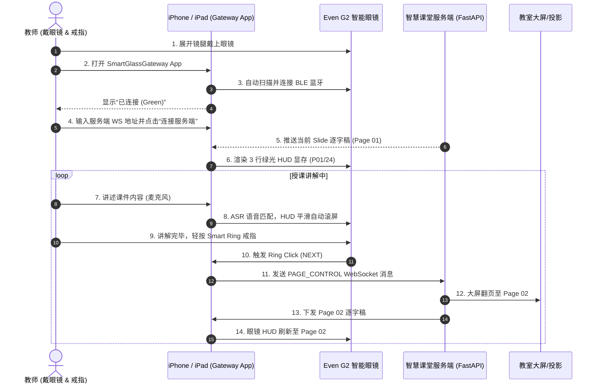

# Even G2 智能眼镜硬件环境准备与连接指南

本指南面向授课教师与开发人员，详细说明 **Even G2 智能眼镜** 与 **Smart Ring 配套戒指** 连接至 iPhone / iPad 的完整准备步骤、必要 App 安装、光学校准及智慧课堂配套应用联调流程。

---

## 1. 硬件与设备准备清单

### 1.1 硬件设备
1. **Even G2 智能眼镜**（含镜盒与充电线）。
2. **Smart Ring 智能戒指**（配套控制戒头）。
3. **iPhone 或 iPad**：
   - 操作系统：iOS 16.0+ 或 iPadOS 16.0+。
   - 蓝牙版本：支持 BLE 5.0 及以上。

---

## 2. 步骤一：安装官方 Even App 与账户激活

1. 在 iPhone / iPad 上打开 **App Store**。
2. 搜索并下载官方应用 **Even Realities**。
3. 打开 Even App，注册/登录账号，并按提示允许以下系统权限：
   - **蓝牙权限**：允许使用蓝牙寻找并连接设备。
   - **位置权限**：允许在使用 App 期间访问位置信息（BLE 扫描必需）。

---

## 3. 步骤二：眼镜与 Smart Ring 蓝牙配对绑定

### 3.1 智能眼镜配对
1. 确保 iPhone / iPad 的 **蓝牙功能已开启**。
2. 展开 Even G2 智能眼镜的镜腿（或从充电盒中取出），眼镜自动开机。
3. 打开 **Even Realities App**，点击 **添加设备** $\rightarrow$ 选择 **Even G2**。
4. App 自动搜索到附近的 Even G2，点击 **连接**。
5. **关键步骤**：iPhone / iPad 屏幕弹出 **“蓝牙配对请求”** 弹窗时，必须点击 **【配对】**。

### 3.2 Smart Ring 戒指绑定
1. 在 Even App 的设备管理界面，选择 **添加外设 / Smart Ring**。
2. 长按 Smart Ring 侧边按键 3 秒直到指示灯蓝灯闪烁。
3. 在 App 中确认连接完成绑定。

---

## 4. 步骤三：显示微调与光学校准 (重要)

为确保在授课过程中眼镜 HUD 上的 3 行逐字稿清晰可读，需进行光学校准：

1. **戴上 Even G2 智能眼镜**，调整鼻托位置，确保视野中央能看到绿色 Micro-LED 画面。
2. 在 Even App 中进入 **显示设置 (Display Settings)**：
   - **瞳距与双眼校准**：调整绿光视口的水平与垂直偏移，消除双眼重影。
   - **亮度调节**：根据教室光线强弱，设置为“自动亮度”或固定 70%+ 亮度。
   - **手势灵敏度**：在手势设置中测试镜腿 Touchpad 触控板与 Smart Ring 点击反馈。
3. **固件更新 (OTA Update)**：检查是否有未完成的眼镜固件更新，如有请点击升级至最新版本。

---

## 5. 步骤四：安装并授权智慧课堂配套 App (SmartGlassGateway)

完成官方 App 的绑定与校准后，安装我们的智慧课堂网关应用：

1. **安装应用**：
   - **开发阶段**：将 iPhone/iPad 通过数据线连接至 Mac，在 VS Code 中使用 `⌘Shift+B` 部署安装，或在 Xcode 中点击 Run 部署到真机。
   - **部署阶段**：通过 TestFlight 或企业级签名直接安装 `SmartGlassGateway.ipa`。
2. **授权必要权限**（首次打开应用时）：
   - **蓝牙访问权限**：点击【允许】，以便应用通信 Even G2 BLE。
   - **麦克风访问权限**：点击【允许】，用于授课语音流捕获。
   - **语音识别权限**：点击【允许】，用于逐字稿滑动窗口比对。

---

## 6. 步骤五：授课现场联调与操作流程

---

## 7. 常见故障排查 (Troubleshooting)

1. **问：iPhone 蓝牙列表中找到了 Even G2，但 SmartGlassGateway App 连不上？**
   - **答**：请先打开官方 Even Realities App，确认眼镜处于“已连接”状态。iOS 要求应用在通过 `CoreBluetooth` 交互前，设备必须已完成系统级绑定。
2. **问：戴上眼镜后绿光 HUD 文本模糊或显示偏斜？**
   - **答**：打开官方 Even App，重新运行“光学校准”，稍微微调眼睛到透镜的物理距离或更换适合的鼻托。
3. **问：按戒指翻页时大屏没有反应？**
   - **答**：检查 SmartGlassGateway App 界面上的“智慧课堂服务端”状态是否显示为绿色“已在线”。确保手机与服务端处于同一 Wi-Fi 局域网下。
