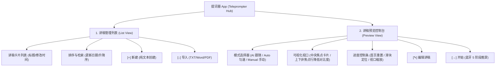
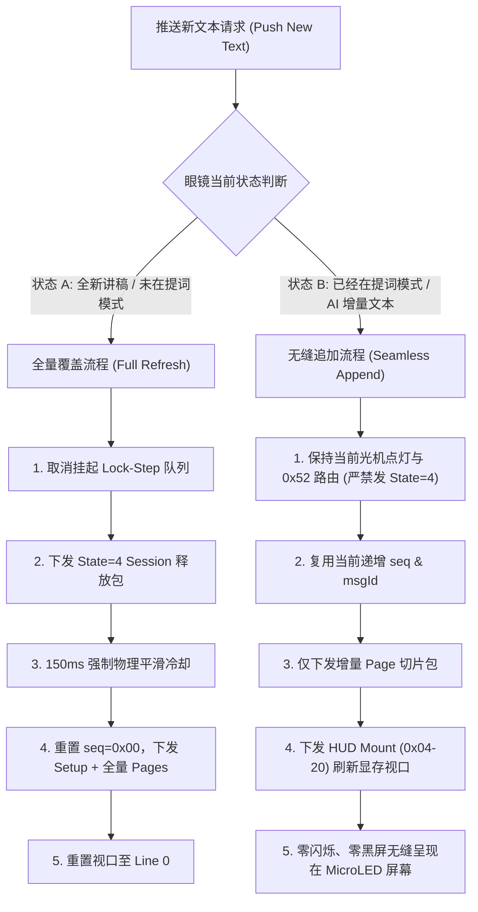

# Even G2 智能眼镜 - 智慧课堂配套应用 需求规格与架构规划说明书

## 1. 项目背景与技术路线
本系统面向使用 **Even G2 智能眼镜** 的授课教师，基于 **“语音页内跟随 + 多模态控屏翻页（眼镜触控 / Apple Watch 替代戒指）+ 显存休眠快速唤醒”** 的融合技术路线，解决脱离电脑台/翻页笔、免视大屏即可掌握讲义逐字稿并精确控制翻页的需求。

---

## 2. 核心功能规范

### 2.1 语音页内跟随 (Voice-Driven In-Slide Auto Scroll)
- **实时音频流匹配**：Mobile Gateway 捕获教师讲话音频流（ASR），通过模糊滑动窗口算法与当前 Slide 的 `script_text` 进行实时定位。
- **HUD 自动平滑滚屏**：确保教师当前正在讲述的句子保持在 Even G2 绿光 HUD 的中央高亮区。
- **脱稿降级机制**：若检测到连续 5 秒未匹配到逐字稿（如老师脱稿解说或回答学生提问），HUD 自动平滑降级显示当前 Slide 的核心提纲 (Bullet Points)。

### 2.2 多模态翻页与控制消息 (Multi-modal Page & Device Control)
系统支持三种外设手势源接入，发出的 WebSocket 消息要求在 **< 150ms** 内驱动教室大屏翻页或响应硬件动作：

1. **Apple Watch 替代官方指环 (Smart Ring Alternative)**：
   - **方式 1（捏手指 Double Tap / AssistiveTouch）**：捏合双指触发大屏翻页，误触率最低。
   - **方式 2（数字表冠 Digital Crown）**：顺时针/逆时针扭动表冠微调逐字稿行高亮与翻页。
   - **方式 3（CoreMotion 手腕甩动 Wrist Flick）**：基于 50Hz IMU 角速度与加速度回弹比对算法（带 1.5s 防抖冷却），手腕快速向上甩动触发翻页。
   - **快捷触发 AI 对话与实时转录**：手表端提供 `🤖 AI对话` 与 `🎤 实时转录` 快捷触控卡片，100% 替代官方物理戒指的按键功能。
   - **watchOS 表盘组件 (Watch Complications)**：支持在 Apple Watch 表盘直接添加一键唤醒图标。
   - **Taptic Engine 震动**：手表接收到任何手势触发成功后，发出 `.click` 触觉震动反馈。
2. **Even G2 HUD 显存休眠与秒级激活 (Display Sleep / Fast Wake)**：
   - 支持在 Apple Watch （点击 `👁️` 按钮）或 iPhone 上一键发送 `SLEEP_HUD` / `WAKE_HUD` 指令。
   - 课间或暂时无需看稿时进入息屏休眠状态（极度省电且无绿光干扰）；讲课时点击**秒级瞬间激活显示**。
3. **Even G2 镜腿 Touchpad / 物理手势**：
   - 镜腿 Touchpad 上滑/下滑。
4. **尾部关键词自动翻页**：
   - 解析逐字稿末尾关键词（如 *"下面来看下一张"*），ASR 命中且置信度 $>0.85$ 时自动触发翻页。

### 2.3 课堂互动与提醒 (HUD Notification)
- **签到状态提醒**：如 `[签到] 已到 42/45 人`。
- **随堂测试与倒计时**：如 `[投票中] 剩余 01:30`。

---

### 2.4 Even G2 官方 App 提词功能与 UI 结构深度解析

根据对官方 iOS 客户端的逆向分析与 UI 界面架构拆解，官方提词器功能由**讲稿管理列表**与**讲稿预览控制台**两大核心视图构成：



#### 1. 讲稿管理列表视图 (Teleprompter List View)
- **讲稿元数据卡片**：展示讲稿标题（如 *“人机协同程序设计课程建设思路_演讲版_逐字稿”*）、最后修改时间（如 *`2026/07/24 22:48`*）及一键进入预览的导航箭头 `>`。
- **排序与筛选机制**：支持按“更新日期”等维度进行下拉筛选，并提供正序/倒序一键切换与记录总数统计（如 *`3 记录`*）。
- **快捷导入与创建**：
  - `[+] 新建`：直接调起内嵌编辑器输入或粘贴演讲文本。
  - `[↓] 导入`：支持从本地 Files / 云盘导入外部文档（TXT、Word、PDF 等）。

#### 2. 讲稿预览与控制台视图 (Teleprompter Preview View)
- **多模态滚动模式选择器 (Mode Selector Dropdown)**：
  - **AI 模式 (`scroll_mode = 1`)**：基于实时语音识别（ASR）与文本滑动窗口算法，按教师当前讲述位置自动进行视口平滑滚动。
  - **Auto 模式 (匀速滚屏)**：设定固定时间速率自动向上滚屏。
  - **Manual 模式 (`scroll_mode = 0`)**：手动模式，通过镜腿 Touchpad 上下滑动、Ring 戒指按键或 Apple Watch 姿态手势手动控制切页与焦点行。
- **可视化视口与焦点高亮区 (Visual Viewport & Active Line Card)**：
  - **中央焦点高亮卡片 (Active Line Card)**：在 App 界面中央以白色卡片强调高亮当前推送至 Glasses 光学镜片中心的段落行。
  - **1:1 镜片成像模拟**：视口上下非焦点文本降低明亮度与对比度显示，镜像模拟 MicroLED 镜片的聚焦阅读视野。
- **物理排版与播放控制条 (Control & Progress Bar)**：
  - **首页复位 (`>||<`)**：一键将视口定位回讲稿第 0 页第 0 行。
  - **进度定位滑块 (Progress Slider)**：带打点圆环 Handle 的进度条，支持拖动实时快速跳转至讲稿的相对百分比位置。
  - **视口缩放与行高调节 (`|-><-|`)**：调整 HUD 的行间距、字体缩放与视口边界。
- **核心动作控制**：
  - `[✎] 编辑`：调起编辑器修改当前讲稿正文。
  - `[→] 开始`：顺序下发 `Auth` -> `DisplayConfig` -> `TeleprompterInit` -> `14 Content Pages` -> `Sync & Route Switch` 五阶段协议，点亮眼镜 MicroLED 屏并开始推屏。

---

## 3. 双向通信 JSON 协议

### 3.1 翻页与设备控制请求 (`PAGE_CONTROL`)
```json
{
  "type": "PAGE_CONTROL",
  "session_id": "sess_20260723_01",
  "action": "NEXT", // "NEXT" | "PREV" | "JUMP" | "SLEEP_HUD" | "WAKE_HUD" | "TRIGGER_AI_CHAT" | "TOGGLE_TRANSCRIBE"
  "trigger_source": "WATCH_DOUBLE_TAP", // "RING_CLICK" | "TOUCHPAD_SWIPE" | "VOICE_KEYWORD" | "WATCH_DOUBLE_TAP" | "WATCH_CROWN" | "WATCH_WRIST_FLICK" | "WATCH_POWER_TOGGLE" | "WATCH_AI_BUTTON"
  "timestamp": 1784783900
}
```

### 3.2 逐字稿与关键词同步 (`TELEPROMPTER_SYNC`)
```json
{
  "type": "TELEPROMPTER_SYNC",
  "session_id": "sess_20260723_01",
  "current_page": 6,
  "total_pages": 24,
  "slide_title": "HOTL 实战 - 指挥 AI 完成结构化预测任务",
  "bullet_points": [
    "1. 声明式 Prompt 与结构化 Output 约束",
    "2. Schema 校验失败时的重试机制"
  ],
  "script_text": "同学们好，今天我们进入第二十四讲...",
  "end_keywords": ["下一张幻灯片", "进入下一节", "来看这个案例"]
}
```

---

## 4. 软件模块架构

1. **`mobile_gateway_ios` (iOS & watchOS 手机/手表网关)**
   - **SmartGlassGateway (iPhone App)**：
     - BLEManager：包含 `sleepHUD()` 与 `wakeHUD()` 显存休眠/激活控制器。
     - SpeechFollowEngine：语音识别与逐字稿比对。
     - WatchSessionManager：管理 Apple Watch 消息解调。
   - **SmartGlassWatch (watchOS Extension)**：
     - 支持 Double Tap 捏手指、Digital Crown 表冠、CoreMotion 手腕甩动、显存快捷开关 `👁️`、`🤖 AI对话` 与 `🎤 实时转录` 卡片。
2. **`server_plugin` (智慧课堂服务端插件)**
   - 维护 Session 页码、幻灯片逐字稿与尾部关键词数据映射。
   - 提供 WebSocket 翻页广播与状态分发机制。

---

## 5. Even G2 物理通信层协议与发包控制规范 (v2.0.0 规范)

### 5.1 1:1 物理点灯与初始化序列 (Setup Sequence)
推送提词界面时，必须严格按顺序下发以下 Setup 指令帧，完成显存布局与光机供电：
1. **Auth 绑定 (0x80-00 / 0x80-20)**：下发 7 包验证安全会话；
2. **视口参数 (0x07-20)**：`08 0A 10 08 6A 06 08 00 10 50 20 00`；
3. **画布布局 (0x03-20)**：定义 10 行文本阵列网格结构；
4. **显存通道与光机供电 (0x0C-20)**：`08 02 10 msgId 22 04 08 01 10 00`；
5. **系统模式与 MicroLED 点灯 (0x30-20)**：`08 01 10 msgId 1A 04 08 01 10 00`；
6. **触控中断解绑定 (0x01-20)**：`22 0C 1A 0A 12 08 1A 06 08 00 10 00 20 01` (`20 01` 使能镜腿滑动中断)；
7. **【关键禁令】绝不发送 22 02 08 01**：Setup 中严禁包含切回 Dashboard (`0x01`) 的指令，保证路由直通 `0x52 Teleprompter` 显存。

### 5.2 发包序号单调递增 (Strict Monotonic Sequence)
- **`seq` 字节与 `msgId` 约束**：从 `0x00` 起始，全量 Protobuf 帧的 `seq` 必须严格单调自增（`0, 1, 2, 3...`），严禁出现静态硬编码序号倒跳；
- **回环保护**：`seq` 达到 255 后，使用 `seq = (seq + 1) & 0xFF` 进行显式溢出回环保护。

### 5.3 120ms 物理发包间隔平滑保护 (Inter-packet Pacing)
- **物理平滑节奏**：两包 `Tx` 发送物理间隔**不得少于 120ms**（收到 ACK 后延时 80ms~120ms 步进）；
- **死锁防护**：严禁在 20ms~30ms 内高频连发爆破，防止撑爆 G2 蓝牙 RX Buffer 引发 MicroLED 显像芯片保护性死锁熄灭（黑屏）。

---

## 6. 系统健壮性与“推送新文本”架构规范



### 6.1 双模式推送新文本处理规范

#### 1. 模式 A：全量讲稿覆盖 (Full Text Replacement)
- **触发条件**：用户选择全新的讲稿文件，或者系统强制重置演讲。
- **处理步骤**：
  1. 调用 `cancelPendingTeleprompterTasks()` 清空挂起队列与超时定时器；
  2. 下发 `Service 06-20 type=4 state=4` 释放包，清空 SRAM 环形缓冲区；
  3. 执行 **150ms 强制物理平滑冷却**；
  4. 重置 `seq = 0x00`，下发全量 Setup 指令帧与 Content Pages，完成重新挂载。

#### 2. 模式 B：增量文本无缝追加/更新 (Incremental Seamless Refresh)
- **触发条件**：眼镜处于提词模式下，AI 实时生成后续段落或 WebSocket 接收增量文本。
- **处理步骤**：
  1. **绝对禁止发送 `State=4 释放` 与 18 包 Setup**（避免引起 MicroLED 物理屏幕闪烁/黑屏）；
  2. **复用当前 Session 递增的 `seq` 与 `msgId`**；
  3. **仅生成并下发新增段落的 `Page X` 报文**；
  4. **下发一包动态 `seq` 的 `HUD Mount (0x04-20)` 刷新显存视口**；
  5. **效果**：MicroLED 屏幕 100% 零闪烁、零黑屏，新文本平滑追加到环形缓冲区与视口中。

---

### 6.2 系统 4 大防线健壮性设计规范

1. **并发锁与防抖机制 (Anti-Reentrancy & Debounce)**
   - 引入 `isPushingText` 并发锁，防止多源（WebSocket / UI 快速点击）并发冲撞；
   - 针对高频实时文本流增加 **300ms 防抖 (Debounce)**，确保发包队列的有序性。
2. **`UInt8` 序号回环保护 (Sequence Rollover Protection)**
   - 在长时演讲场景下，发包数超过 255 时，使用 `seq = (seq + 1) & 0xFF`，保证 `UInt8` 不溢出 Crash。
3. **蓝牙断开自愈与现场恢复 (BLE Reconnection State Recovery)**
   - 蓝牙重连成功后，App 自动校验 `isTeleprompterSessionActive`；
   - 根据记录的 `currentFocusPageLine` 自动恢复现场，重新下发 Setup + 对应行号，做到**断线无感恢复看屏**。
4. **心跳保活与异常路由拉回 (Heartbeat & Route Auto-Revert)**
   - 处于提词模式时，超过 10 秒无触控操作自动触发 `0x0D-20` 心跳查询；
   - 若发现眼镜 MCU 误切回 Dashboard (`0x32`)，自动下发 `0x09-20` 将路由**拉回 `0x52 Teleprompter`**，保证持续看屏。
