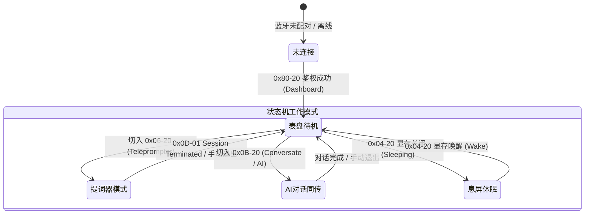
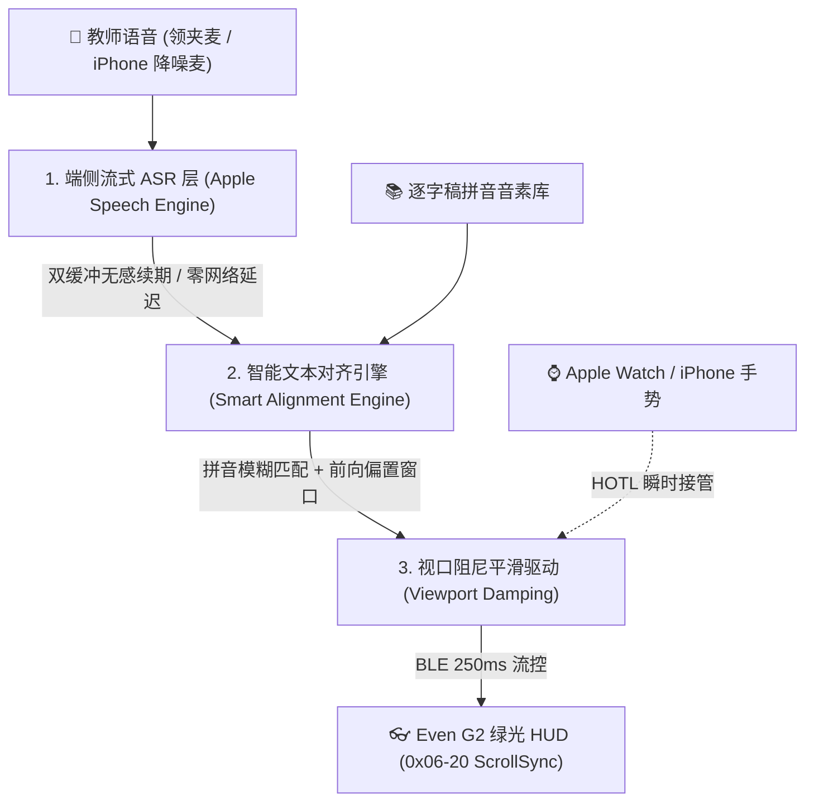
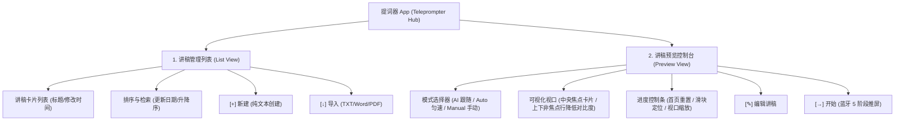
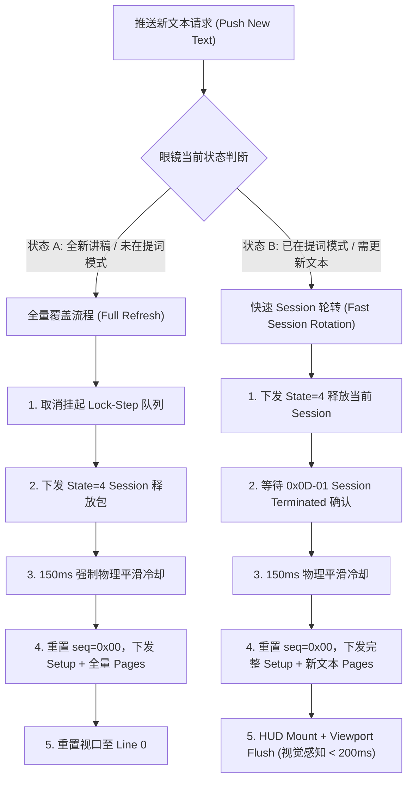
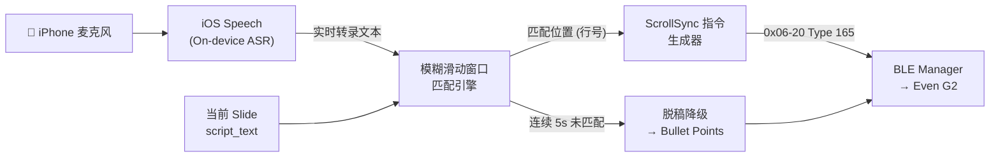
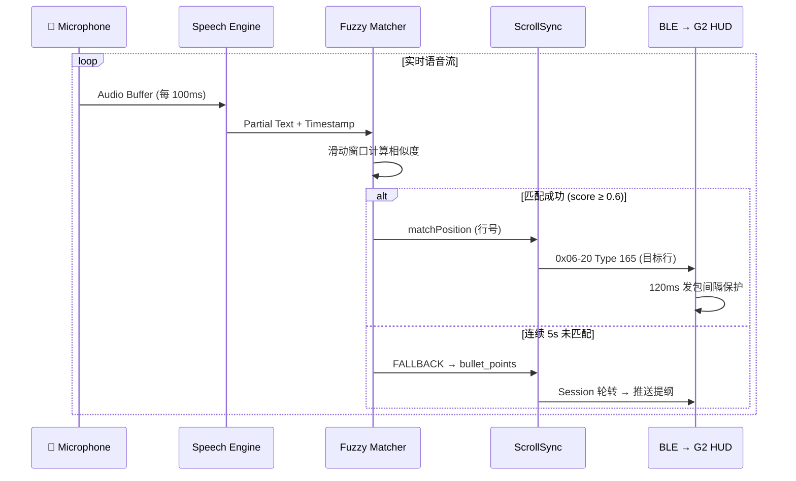

# Even G2 智能眼镜 - 智慧课堂配套应用 需求规格与架构规划说明书

## 1. 项目背景与技术路线
本系统面向使用 **Even G2 智能眼镜** 的授课教师，基于 **"自研 AI 语音跟随 + 多模态控屏翻页（眼镜触控 / Apple Watch 替代戒指）+ 显存休眠快速唤醒"** 的融合技术路线，解决脱离电脑台/翻页笔、免视大屏即可掌握讲义逐字稿并精确控制翻页的需求。

> ⚠️ **自研 AI 模式动因**：官方 Even AI APP 的 AI 跟随模式 (`scroll_mode = 1`) 在实际课堂使用中存在**频繁失灵**问题——表现为运行一段时间后语音匹配引擎停止响应，提词文本不再滚动，需要手动操作恢复。该缺陷在连续授课场景下严重影响教学体验，因此决定自研基于本地/边缘 ASR + 模糊匹配的语音跟随引擎。

> 💡 **技术选型**：采用 Apple on-device Speech 框架作为 ASR 引擎，利用 iOS 端侧推理能力实现零网络延迟的实时语音识别，配合自研模糊滑动窗口匹配算法完成文本定位。该方案不依赖官方 APP 的黑盒 ASR 通道，可完全控制匹配策略与降级逻辑。

---

## 2. 核心功能规范与眼镜状态机架构

### 2.0 智能眼镜全状态同步状态机 (Glasses State Machine Architecture - 核心底层架构)

iOS 宿主 App (`SmartGlassGateway`) 必须维护一个全局可观测、双向同步的 **眼镜工作模式状态机 (`GlassesState`)**。移动网关必须根据当前工作模式在 App UI 上提供显式切换入口，并根据模式动态呈现专属的操控视图与遥测仪表盘。



#### 2.0.1 状态机工作模式分类 (基于 100% 反编译验证的服务体系)
1. **`.disconnected` (未连接)**：BLE 通道断开，UI 提示蓝牙连接引导。
2. **`.dashboard` (主页仪表盘模式)**：眼镜停留在默认时钟、天气与功能主菜单 (`Service 0x07-20 Dashboard`)，UI 显示系统总览与主页控制项。
3. **`.teleprompter` (提词前台模式)**：眼镜前台运行提词 App (`Service 0x06-20 Teleprompter`)，UI 呈现视口高亮卡片、行号滑块与滚屏控制。
4. **`.conversate` (AI对话与实时同传模式)**：眼镜前台运行语音听写与 Even AI 对话 (`Service 0x0B-20 Conversate`)，UI 呈实时双语字幕流与 ASR 响应卡片。
5. **`.sleeping` (显存息屏休眠态)**：MicroLED 光学引擎息屏省电 (`Service 0x04-20 Wake/Sleep`)，UI 显示醒目的唤醒激活按钮。

#### 2.0.2 UI 响应与模式感知要求
- **模式切换选择器 (UI Segmented Mode Picker)**：iOS App 顶部必须提供直观的模式切换 Bar，允许教师一键在 `[ 表盘待机 | 提词模式 | AI对话 | 息屏休眠 ]` 之间手动切换。
- **实时 Notify 自动同步**：网关必须实时监听 `5402` 特征值的 `0x0D-01` (Session Terminated) 等硬件 Notify，当物理眼镜发生长按或状态变更时，App UI 与状态机必须**毫秒级自动同步更新**。
- **模式感知的 Watch 手势路由**：当 Apple Watch 发来 1:1 触控手势时，网关必须根据当前 `GlassesState` 智能分发至对应模式的处理逻辑。
- **提词失效自动重连拉起 (Auto Teleprompter Recovery)**：若眼镜因外界干扰或误触退出提词模式回到表盘，网关在收到任何滚动或翻页指令时自动感知当前状态，若不在提词状态，毫秒级自愈重新触发提词推屏（Setup + Init 链路），保障提词器永不失联。

---

### 2.1 自研 AI 语音跟随提词引擎规范 (Self-developed AI Speech-Follow Teleprompter Engine)

> 📘 **详细技术架构与算法设计规格书**：请参阅 [`docs/AI_Speech_Follow_Teleprompter_Design.md`](AI_Speech_Follow_Teleprompter_Design.md)。

#### 2.1.1 痛点剖析与自研动因
官方 Even AI 原厂 App 的 AI 跟随模式 (`scroll_mode = 1`) 在真实高校教学中存在四大致命缺陷：
1. **ASR 链路静默假死**：连续授课数分钟后，原厂音频通道与匹配引擎静默超时挂起，HUD 文本永久冻结；
2. **脱稿答疑即兴发挥无容错**：教师离开逐字稿解答提问时，字面匹配失败引发视口剧烈跳动或彻底迷失上下文；
3. **同音字与口语助词极其脆弱**：依赖严格字符匹配，遇到口语虚词（“那个”、“然后”）或生僻专业词同音错字时匹配中断；
4. **人工介入冲突**：缺乏优雅的人机协同（HOTL）弹性，AI 滚屏与教师手动微调互相抢焦。

#### 2.1.2 总体系统架构（端侧三层协同流水线）
自研引擎彻底抛弃外部黑盒通道，依托 iOS 端侧低延迟流式推理与自研对齐算法构建端到端管线：


#### 2.1.3 核心算法规范
1. **拼音音素化降维映射 (Pinyin Phonetic Alignment)**：
   - 逐字稿与实时 ASR 增量文本均通过 `CFStringTransform` 转为“声母+韵母”音素序列，抹平同音字与口音误差，计算音素级最长公共子序列（LCS）。
2. **非对称前向偏置滑动窗口 (Forward-Biased Sliding Window)**：
   - 设当前视口基准行为 $L_{curr}$，搜索窗口定义为 $[\max(0, L_{curr}-1), \min(|L|-1, L_{curr}+4)]$；
   - 遵循演讲单向时间箭头，前瞻行赋予 $1.25\times$ 权重，回退仅限 1 行，**坚决杜绝视口倒吸回弹**。
3. **脱稿智能阻尼保持 (Digression Deadband Guard)**：
   - 教师展开课外案例或答疑时，匹配置信度连续低于阈值进入“脱稿驻留态”，**视口绝对锁死保持原位**，严禁乱滚；
   - 当教师讲回原稿时，算法自动重咬合并平滑过渡，恢复跟随。
4. **视口死区滤波与 BLE 流控 (Viewport Deadband & Flow Control)**：
   - Even G2 HUD 具有 5~6 行有效展示高度；目标行位于中央视口（第 2~4 行）时维持静止，仅当读到视口下沿（$\ge$ 第 4 行）时才平移视口，保持焦点行处于黄金阅读带；
   - 视口滚动发包最小间隔 $\ge 250\text{ms}$，保护 MCU 蓝牙吞吐。
5. **人在回路（HOTL）物理手势瞬时抢占**：
   - 教师通过手表转腕、表冠或触控板发出任何手动介入指令时，AI 引擎进入 **3 秒静默让位周期**，人工意图绝对优先。
6. **尾部语义锚点自动切页 (Auto-Slide Pivot)**：
   - 读到本页逐字稿末尾两行且命中尾部结束语（如 *“下面我们看下一页”*）时，引擎向网关派发自动换页事件，调用 `LectureSessionManager.gotoNextSlide()` 完成平滑翻页。

#### 2.1.4 端侧 ASR 双缓冲无感续期机制
- 强制使用 `SFSpeechRecognizer(locale: "zh-CN")` 且 `requiresOnDeviceRecognition = true`，延迟稳定在 60~120ms，零隐私外泄；
- 维护 `ActiveTask` 与 `StandbyTask` 双任务队列，在 50 秒临界点或切页长静音区间静默预热无缝轮替，突破苹果 60 秒限制，实现全天授课不掉线。

---

### 2.2 多模态翻页与控制规范 (Multi-modal Page & Device Control)
系统提供“智能语音自动跟随 + 物理手势高灵敏接管”双轨融合操控，外设手势与换页响应延时要求 **< 150ms**：

1. **Apple Watch 1:1 眼镜触控板替代与双姿态转腕 (最高优先级)**：
   - **触控板 1:1 物理映射**：
     - **单击 (Single Tap)**：1:1 映射镜腿物理单击（确认 / 视口推进 1 行）；
     - **双击 (Double Tap)**：1:1 映射镜腿物理双击（唤醒/退出/模式切换）；
     - **上下滑动 (Swipe Up / Down)**：1:1 映射镜腿物理滑动（视口滚动 / 列表翻页）。
   - **双姿态手腕转动翻页 (Dual-Posture Wrist Rotation)**：
     - **桌面平放姿态 (Desk / Sitting)**：手臂平放于讲台桌面（`Pitch` 介于 -0.8 ~ 0.5 rad，重力 $Z < -0.6$），手腕向前快速下压内旋翻页（角速度阈值 $8.0\text{ rad/s}$）；
     - **自然垂手姿态 (Standing / Arm Hanging)**：手臂自然下垂站立讲课（`Pitch` 处于陡峭垂直角），手腕向下快速甩动翻页（角速度阈值 $6.8\text{ rad/s}$）；
     - **触觉确认反馈**：手势触发后仅发出纯物理静音震动（`WKHapticType.click`），无任何刺耳声音，静默沉浸。
2. **Even G2 原生镜腿物理 Touchpad**：
   - 镜腿 Touchpad 上滑/下滑无缝映射视口平移与翻页，并实时同步给网关状态机。
3. **iPhone 陀螺仪体感遥控**：
   - 讲桌放置或手持手机场景下，向右快速甩动手机即可触发幻灯片与提词器翻页。
4. **统一换页调用收口与 3.0s 硬件注销黄金保底超时门禁 (Anti-Blackscreen Pipeline)**：
   - **单入口架构**：手表滑动/转腕、手机体感、UI 按钮 100% 统一路由至 `LectureSessionManager.gotoNextSlide()` / `gotoPreviousSlide()`；
   - **消除服务端回声**：手势翻页严禁单独发冗余广播，彻底消除 WebSocket 回声引起的二次推屏并发冲突；
   - **3.0s 黄金超时门禁**：换页注销 Even G2 旧会话时，设置 3.0s 保底超时，并在收到硬件 `0x0D-01 Session Terminated` 时立即 cancel 推进。正常耗时仅 450~600ms，在 MCU 长尾延迟时耐心等待硬件清空，**彻底根除奇偶页黑屏故障**。
5. **Even G2 HUD 显存休眠与秒级激活 (Display Sleep / Fast Wake)**：
   - 支持在 Apple Watch （点击 `👁️` 按钮）或 iPhone 上一键发送 `SLEEP_HUD` / `WAKE_HUD` 指令，课间熄灭 MicroLED，上课秒级唤醒点亮。

### 2.3 课堂互动与提醒 (HUD Notification)
- **签到状态提醒**：如 `[签到] 已到 42/45 人`。
- **随堂测试与倒计时**：如 `[投票中] 剩余 01:30`。

---

### 2.4 Even G2 官方 App 提词功能与 UI 结构深度解析

根据对官方 iOS 客户端的逆向分析与 UI 界面架构拆解，官方提词器功能由**讲稿管理列表**与**讲稿预览控制台**两大核心视图构成：



#### 1. 讲稿管理列表视图 (Teleprompter List View)
- **讲稿元数据卡片**：展示讲稿标题（如 *“人机协同程序设计课程建设思路_演讲版_逐字稿”*）、最后修改时间（如 *`2026/07/24 22:48`*）及一键进入预览的导航箭头 `>`。
- **排序与筛选机制**：支持按“更新日期”等维度进行下拉筛选，并提供正序/倒序一键切换与记录总数统计（如 *`3 记录`*）。
- **快捷导入与创建**：
  - `[+] 新建`：直接调起内嵌编辑器输入或粘贴演讲文本。
  - `[↓] 导入`：支持从本地 Files / 云盘导入外部文档（TXT、Word、PDF 等）。

#### 2. 讲稿预览与控制台视图 (Teleprompter Preview View)
- **多模态滚动模式选择器 (Mode Selector Dropdown)**：
  - **AI 模式 (`scroll_mode = 1`)**：基于实时语音识别（ASR）与文本滑动窗口算法，按教师当前讲述位置自动进行视口平滑滚动。
  - **Auto 模式 (匀速滚屏)**：设定固定时间速率自动向上滚屏。
```json
{
  "type": "TELEPROMPTER_SYNC",
  "session_id": "sess_20260723_01",
  "current_page": 6,
  "total_pages": 24,
  "slide_title": "HOTL 实战 - 指挥 AI 完成结构化预测任务",
  "bullet_points": [
    "1. 声明式 Prompt 与结构化 Output 约束",
    "2. Schema 校验失败时的重试机制"
  ],
  "script_text": "同学们好，今天我们进入第二十四讲...",
  "end_keywords": ["下一张幻灯片", "进入下一节", "来看这个案例"]
}
```

---

## 4. 软件模块架构

1. **`mobile_gateway_ios` (iOS & watchOS 手机/手表网关)**
   - **SmartGlassGateway (iPhone App)**：
     - BLEManager：包含 `sleepHUD()` 与 `wakeHUD()` 显存休眠/激活控制器。
     - SpeechFollowEngine：语音识别与逐字稿比对。
     - WatchSessionManager：管理 Apple Watch 消息解调。
   - **SmartGlassWatch (watchOS Extension)**：
     - 支持 Double Tap 捏手指、Digital Crown 表冠、CoreMotion 手腕甩动、显存快捷开关 `👁️`、`🤖 AI对话` 与 `🎤 实时转录` 卡片。
2. **`server_plugin` (智慧课堂服务端插件)**
   - 维护 Session 页码、幻灯片逐字稿与尾部关键词数据映射。
   - 提供 WebSocket 翻页广播与状态分发机制。

---

## 5. Even G2 物理通信层协议与发包控制规范 (v2.0.0 规范)

### 5.1 1:1 物理点灯与初始化序列 (Setup Sequence)
推送提词界面时，必须严格按顺序下发以下 Setup 指令帧，完成显存布局与光机供电：
1. **Auth 绑定 (0x80-00 / 0x80-20)**：下发 7 包验证安全会话；
2. **视口参数 (0x07-20)**：`08 0A 10 08 6A 06 08 00 10 50 20 00`；
3. **画布布局 (0x03-20)**：定义 10 行文本阵列网格结构；
4. **显存通道与光机供电 (0x0C-20)**：`08 02 10 msgId 22 04 08 01 10 00`；
5. **系统模式与 MicroLED 点灯 (0x30-20)**：`08 01 10 msgId 1A 04 08 01 10 00`；
6. **触控中断解绑定 (0x01-20)**：`22 0C 1A 0A 12 08 1A 06 08 00 10 00 20 01` (`20 01` 使能镜腿滑动中断)；
7. **【关键禁令】绝不发送 22 02 08 01**：Setup 中严禁包含切回 Dashboard (`0x01`) 的指令，保证路由直通 `0x52 Teleprompter` 显存。

### 5.2 发包序号单调递增 (Strict Monotonic Sequence)
- **`seq` 字节与 `msgId` 约束**：从 `0x00` 起始，全量 Protobuf 帧的 `seq` 必须严格单调自增（`0, 1, 2, 3...`），严禁出现静态硬编码序号倒跳；
- **回环保护**：`seq` 达到 255 后，使用 `seq = (seq + 1) & 0xFF` 进行显式溢出回环保护。

### 5.3 120ms 物理发包间隔平滑保护 (Inter-packet Pacing)
- **物理平滑节奏**：两包 `Tx` 发送物理间隔**不得少于 120ms**（收到 ACK 后延时 80ms~120ms 步进）；
- **死锁防护**：严禁在 20ms~30ms 内高频连发爆破，防止撑爆 G2 蓝牙 RX Buffer 引发 MicroLED 显像芯片保护性死锁熄灭（黑屏）。

---

## 6. 系统健壮性与“推送新文本”架构规范



### 6.1 双模式推送新文本处理规范

#### 1. 模式 A：全量讲稿覆盖 (Full Text Replacement)
- **触发条件**：用户选择全新的讲稿文件，或者系统强制重置演讲。
- **处理步骤**：
  1. 调用 `cancelPendingTeleprompterTasks()` 清空挂起队列与超时定时器；
  2. 下发 `Service 06-20 type=4 state=4` 释放包，清空 SRAM 环形缓冲区；
  3. 执行 **150ms 强制物理平滑冷却**；
  4. 重置 `seq = 0x00`，下发全量 Setup 指令帧与 Content Pages，完成重新挂载。

#### 2. 模式 B：快速 Session 轮转更新 (Fast Session Rotation Refresh)
- **触发条件**：眼镜处于提词模式下，需要更新文本内容（如 AI 语音跟随触发翻页后加载下一段逐字稿，或 WebSocket 接收到新文本）。
- **关键约束 (经 §23.2 验证)**：Even G2 MCU **不支持在活跃 Session 内直接覆写或追加文本**——不存在"预填充后台 Buffer 再翻转"的能力。切换文本的唯一路径是完整的 **Session 销毁→重建闭环**。
- **处理步骤**：
  1. 下发 `Service 06-20 type=4 state=4` 释放当前 Session；
  2. 等待眼镜 MCU 返回 `0x0D-01 Session Terminated` 确认（物理注销完成）；
  3. 执行 **150ms 物理平滑冷却** 窗口；
  4. 重置 `seq = 0x00`（MCU 在 Session Terminated 后会重置 Seq 计数器），下发完整 Setup + 新文本 Pages；
  5. 下发 `HUD Mount (0x04-20)` 与 `Viewport Flush Line 0 (0x06-20 Type 165)` 完成挂载。
- **效果**：虽然经历 Session 销毁→重建，但因 150ms 窗口极短，视觉上用户感知接近无缝（MicroLED 亮度变化 < 200ms）。

---

### 6.2 系统 4 大防线健壮性设计规范

1. **并发锁与防抖机制 (Anti-Reentrancy & Debounce)**
   - 引入 `isPushingText` 并发锁，防止多源（WebSocket / UI 快速点击）并发冲撞；
   - 针对高频实时文本流增加 **300ms 防抖 (Debounce)**，确保发包队列的有序性。
2. **`UInt8` 序号回环保护 (Sequence Rollover Protection)**
   - 在长时演讲场景下，发包数超过 255 时，使用 `seq = (seq + 1) & 0xFF`，保证 `UInt8` 不溢出 Crash。
3. **蓝牙断开自愈与现场恢复 (BLE Reconnection State Recovery)**
   - 蓝牙重连成功后，App 自动校验 `isTeleprompterSessionActive`；
   - 根据记录的 `currentFocusPageLine` 自动恢复现场，重新下发 Setup + 对应行号，做到**断线无感恢复看屏**。
4. **心跳保活与异常路由拉回 (Heartbeat & Route Auto-Revert)**
   - 处于提词模式时，超过 10 秒无触控操作自动触发 `0x0D-20` 心跳查询；
   - 若发现眼镜 MCU 误切回 Dashboard (`0x32`)，自动下发 `0x09-20` 将路由**拉回 `0x52 Teleprompter`**，保证持续看屏。

---

## 7. 自研 AI 语音跟随架构规划 (Self-developed Voice Following Architecture)

### 7.1 系统架构总览



### 7.2 核心组件设计

#### 7.2.1 ASR 引擎 (SpeechRecognitionEngine)
- **框架**：iOS `Speech.framework`，使用 `SFSpeechAudioBufferRecognitionRequest` 流式识别
- **模式**：On-device 推理（`requiresOnDeviceRecognition = true`），零网络延迟
- **语言**：`zh-CN` (普通话)，支持运行时切换
- **输出**：实时输出 partial results（`shouldReportPartialResults = true`），每次回调携带累积文本与时间戳

#### 7.2.2 模糊滑动窗口匹配器 (FuzzySlideWindowMatcher)
- **输入**：ASR partial text + 当前 Slide 的 `script_text`
- **算法**：在 `script_text` 上维护一个滑动窗口（窗口大小 = ASR 最近 N 个字），计算窗口内文本与 ASR 输出的编辑距离 / Jaccard 相似度
- **匹配阈值**：相似度 ≥ 0.6 视为匹配成功，更新 `currentMatchPosition`
- **滑动策略**：窗口仅前向滑动（教师不会倒退念稿），降低搜索空间

#### 7.2.3 ScrollSync 指令生成器 (ScrollSyncController)
- 将 `currentMatchPosition`（行号）映射为 `0x06-20 Type 165` ScrollSync 帧的目标行偏移
- 平滑插值：避免跳帧，采用逐行步进下发（每 300ms 最多推进 1 行）
- 与 BLE 发包队列协调：复用 §5.3 的 120ms 物理发包间隔保护

#### 7.2.4 脱稿降级控制器 (DigressionFallbackController)
- **触发条件**：连续 5 秒匹配得分 < 0.3（教师脱稿或回答学生问题）
- **降级行为**：HUD 切换显示当前 Slide 的 `bullet_points`（需要 Session 轮转更新文本，参见 §6 模式 B）
- **恢复机制**：当匹配得分恢复 ≥ 0.6 时，自动切回逐字稿显示并定位到匹配行

### 7.3 数据流时序



### 7.4 可观测性设计
- **实时日志面板**：iPhone 调试界面展示 ASR 文本、匹配得分、窗口位置的实时滚动日志
- **匹配热力图**：记录每行 script_text 的匹配次数与得分分布，用于事后分析匹配策略有效性
- **性能指标**：ASR → 匹配 → 下发 BLE 的端到端延迟 (Target: < 500ms P95)
