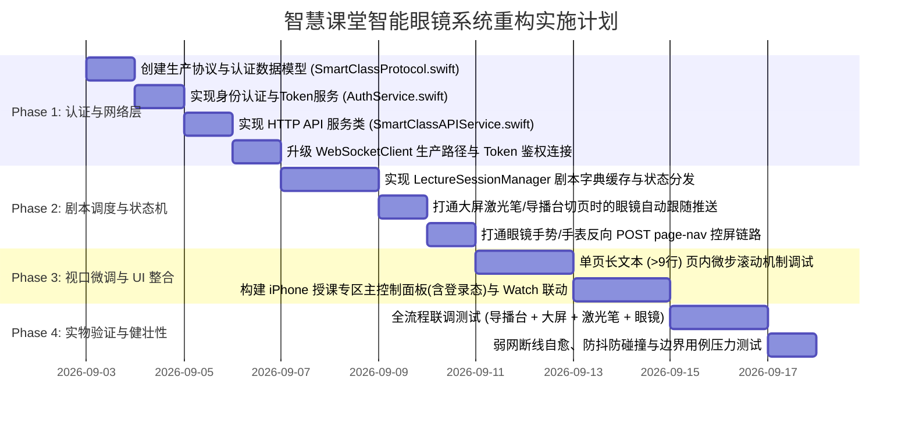

# 智慧课堂智能眼镜系统生产对接与重构计划 (Smart Classroom Refactoring Plan)

> **版本**: v1.0  
> **编制日期**: 2026-09-03  
> **目标工程**: `mobile_gateway_ios` (SmartGlassGateway & SmartGlassWatch) ↔ `smart-class-backend` (FastAPI)  
> **对齐标准**: [Slide_Navigation_Protocol.md](Slide_Navigation_Protocol.md) (v1.0)

---

## 1. 背景与重构目标

### 1.1 现状与痛点
1. **Mock 依赖与协议脱节**：当前 iOS App (`mobile_gateway_ios`) 主要依赖本地简易的 `server_plugin/main.py` 与 Mock 数据，采用自定义的 `TELEPROMPTER_SYNC` 消息；每次翻页均通过 WebSocket 发送整段大文本，未能对齐生产环境规范。
2. **缺乏身份认证与 Token 鉴权机制**：生产环境核心接口（如 `GET /api/sessions/{session_id}/info`）严格要求 `Authorization: Bearer <token>` 凭据，WebSocket 握手也需携带 `?token=<JWT>` 识别教师身份。现有代码完全缺乏登录、Token 获取、Keychain 存储及自动刷新逻辑，直接对接生产会导致 401 拒绝或无法激活课时。
3. **缺乏预载与纯净口述稿支持**：目前依赖客户端即时接收文本，若遇到弱网容易丢字或断流。生产环境已经具备 `GET /smart-class/api/sessions/{session_id}/info` 接口，可一次性下发经由服务端预解析、已剔除视觉指令 `(Visual: ...)` 与停顿标记 `[Break: ...]` 的纯净口述分段（`playbook_data.segments`）。
4. **单页长文本超屏（>9行）视口控制未打通**：在生产授课中，每页幻灯片的逐字稿往往包含 100~300 字。当前系统缺乏“大翻页（宏观切页）”与“单段焦点推进（微观滚动）”的两级协作机制。
5. **反向控屏信令未接入生产标准**：目前手表/眼镜手势发送的是私有 `PageControlCommand`，而生产规范中统一采用与大屏激光翻页笔完全对等的 `POST /smart-class/api/sessions/{session_id}/page-nav`。

### 1.2 重构核心目标
* **目标 1（安全接入与身份认证闭环）**：实现生产环境标准的身份认证链路，提供“账号密码登录”与“演练安全码快捷登录”双模式；通过 Keychain 安全持久化 JWT Token，全自动为 REST 请求与 WebSocket 注入鉴权凭据，并具备 401 自动处理与注销保护。
* **目标 2（零延迟预载）**：进入课堂时，通过标准 REST 接口拉取整课剧本并构建 `[slide_index: 纯净文本]` 本地缓存字典，断网离线亦可维持提词连续性。
* **目标 3（双向毫秒级联动）**：
  * **正向跟随**：订阅生产 WebSocket 信道，监听到 `STATE_SYNC` (`currentPageIndex`) 或 `PAGE_NAV` (`target_page`) 时，眼镜端瞬时切页并重置视口到第 0 行。
  * **反向控屏**：镜腿双击、手势滑动或 Apple Watch 触发切页时，调用标准 `POST /page-nav` 广播切页指令，驱动大屏与导播台无缝换页。
* **目标 4（长文本微步滚动体验）**：针对单页超 9 行提词，利用 G2 协议的 `sendScrollSync(lineIndex:)`（`0x06-20 Type 165` 报文）实现毫秒级平滑视口推进，降低讲者认知负荷。
* **目标 5（架构解耦与工程健壮性）**：严格统一全链路 **0-based** 索引规范，增加网络断线自愈、防抖落库协同与蓝牙推送重入互斥防护。

---

## 2. 总体集成架构与通信拓扑

智能眼镜移动网关作为智慧课堂生态中的 **“第四终端 (HUD 辅驾)”**，与其它终端的拓扑关系如下：

```
                    ┌────────────────────────┐
                    │ 导播台 (iPad / 教师端)  │
                    │      (App.tsx)         │
                    └───────────┬────────────┘
                                │ 1. WS STATE_SYNC (100ms 防抖)
                                │ 2. PUT page-index (1s 防抖持久化)
                                ▼
                    ┌────────────────────────┐
                    │  smart-class-backend   │
                    │  (FastAPI + Redis + DB)│
                    └───────────▲────────────┘
                                │ 
        ┌───────────────────────┼───────────────────────┐
        │ 4. WS PAGE_NAV        │ 0. POST /api/auth/*   │ 3. POST page-nav
        │    (广播切页)         │    (获取 JWT Token)   │    (反向控屏)
        │                       │ 1. GET /info (鉴权)   │
        ▼                       ▼                       ▼
┌───────────────┐       ┌──────────────────────────────────────┐
│ 教室投影大屏   │       │ iPhone 移动网关 (SmartGlassGateway)   │
│  (Screen.tsx) │       │ - AuthService (Token & Keychain)     │
└───────┬───────┘       │ - Playbook 缓存字典 ([Page: Text])    │
        │               │ - WebSocket 广播监听器 (?token=JWT)   │
        ▼               └──────────────────┬───────────────────┘
 讲台实体激光翻页笔                         │ 5. BLE 0x06-20 (Type 165/Content)
                                           ▼
                                ┌──────────────────────┐
                                │  Even G2 智能眼镜     │
                                │ (当前页 HUD 提词/滚动)│
                                │ (镜腿手势反向切页)    │
                                └──────────────────────┘
```

### 终端职责矩阵

| 终端角色 | 网络身份 | 核心业务职责 | 鉴权要求 |
| :--- | :--- | :--- | :--- |
| **导播台 (iPad)** | HTTP / WS Client | 课程选择、备课剧本展示、全局交互控制、大字号提词 | Bearer JWT (教师/管理员) |
| **投影大屏 (PC)** | HTTP / SSE / WS Client | 幻灯片渲染展示、接收讲台实体翻页笔输入并反向通知 | 免密 / 可选 Token |
| **后端中枢 (FastAPI)** | Server (SSOT) | 账号鉴权签发、课件状态维护、剧本分段解析、Redis 广播、页码落库 | JWT 校验 / RBAC 鉴权 |
| **手机网关 (iPhone)** | HTTP / WS / BLE Master | **身份认证与 Token 托管**、拉取并缓存全课口述稿、转译 BLE 协议至眼镜 | **Bearer JWT (教师工号绑定)** |
| **智能眼镜 (Even G2)** | BLE Peripheral (HUD) | 实时近眼显示提词内容、接收滚动指令、镜腿手势回传 | BLE 绑定凭据 |
| **智能手表 (Apple Watch)** | WatchConnectivity | 腕上监看当前页码与提词摘要，提供实体旋钮/按钮便捷切页 | 继承 iPhone 网关会话 |

---

## 3. 重构技术方案与模块改造清单

### 模块 1：数据模型层重构 (`SmartGlassGateway/Models/`)

#### [NEW] `SmartClassProtocol.swift`
新增对齐生产环境的数据模型，保证 0-based 语义和 JSON 字段无缝映射：

```swift
// MARK: - 生产环境 Session Info
struct SmartClassSessionInfo: Codable {
    let sessionId: String
    let courseName: String
    let sessionName: String
    let phase: String
    let script: String?
    let playbookData: PlaybookData?
    let currentPageIndex: Int
    let imageBaseUrl: String?
    
    enum CodingKeys: String, CodingKey {
        case sessionId = "session_id"
        case courseName = "course_name"
        case sessionName = "session_name"
        case phase, script
        case playbookData = "playbook_data"
        case currentPageIndex = "current_page_index"
        case imageBaseUrl = "image_base_url"
    }
}

// 预解析语音片段
struct PlaybookData: Codable {
    let segments: [PlaybookSegment]
}

struct PlaybookSegment: Codable {
    let id: String
    let text: String
    let slideIndex: Int
    
    enum CodingKeys: String, CodingKey {
        case id, text
        case slideIndex = "slide_index"
    }
}

// WebSocket 信令模型
struct SmartClassStateSyncMessage: Codable {
    let type: String
    let sender: String?
    let payload: StateSyncPayload
    
    struct StateSyncPayload: Codable {
        let currentPageIndex: Int
        let totalSlides: Int?
        let qrContent: String?
    }
}

struct SmartClassPageNavMessage: Codable {
    let type: String
    let targetPage: Int
    let sender: String?
    
    enum CodingKeys: String, CodingKey {
        case type
        case targetPage = "target_page"
        case sender
    }
}

// MARK: - 身份认证与凭证模型
struct LocalLoginRequest: Codable {
    let username: String
    let password: String
}

struct DevLoginRequest: Codable {
    let username: String
    let role: String
    let accessCode: String
    
    enum CodingKeys: String, CodingKey {
        case username, role
        case accessCode = "access_code"
    }
}

struct AuthTokenResponse: Codable {
    let accessToken: String
    let tokenType: String
    let userId: String?
    let role: String?
    
    enum CodingKeys: String, CodingKey {
        case accessToken = "access_token"
        case tokenType = "token_type"
        case userId = "user_id"
        case role
    }
}

struct UserProfile: Codable {
    let username: String
    let fullName: String?
    let role: String
    
    enum CodingKeys: String, CodingKey {
        case username
        case fullName = "full_name"
        case role
    }
}
```

---

### 模块 2：网络与接口通信层 (`SmartGlassGateway/Services/`)

#### [NEW] `AuthService.swift`
独立的身份认证管理服务，负责凭证存储（Keychain 安全持久化）、登录换票与 401 拦截：

```swift
import Foundation
import Security

class AuthService: ObservableObject {
    static let shared = AuthService()
    
    @Published var token: String?
    @Published var currentUser: UserProfile?
    @Published var isAuthenticated: Bool = false
    
    private let tokenKey = "com.smartcourse.smartglass.jwt"
    private let session = URLSession(configuration: .default)
    
    init() {
        self.token = readTokenFromKeychain()
        self.isAuthenticated = (token != nil)
    }
    
    /// 1. 本地账号密码登录: POST /smart-class/api/auth/login
    func login(baseURL: String, request: LocalLoginRequest, completion: @escaping (Result<String, Error>) -> Void) {
        postAuth(baseURL: baseURL, path: "/smart-class/api/auth/login", body: request, completion: completion)
    }
    
    /// 2. 演练/开发环境快捷登录: POST /smart-class/api/auth/dev-login
    func devLogin(baseURL: String, request: DevLoginRequest, completion: @escaping (Result<String, Error>) -> Void) {
        postAuth(baseURL: baseURL, path: "/smart-class/api/auth/dev-login", body: request, completion: completion)
    }
    
    /// 3. 校验 Token 并获取当前用户信息: GET /smart-class/api/users/me
    func validateToken(baseURL: String, completion: @escaping (Result<UserProfile, Error>) -> Void) {
        guard let token = self.token else {
            completion(.failure(URLError(.userAuthenticationRequired)))
            return
        }
        let cleanBase = baseURL.trimmingCharacters(in: CharacterSet(charactersIn: "/"))
        guard let url = URL(string: "\(cleanBase)/smart-class/api/users/me") else {
            completion(.failure(URLError(.badURL)))
            return
        }
        var req = URLRequest(url: url)
        req.setValue("Bearer \(token)", forHTTPHeaderField: "Authorization")
        
        session.dataTask(with: req) { [weak self] data, response, error in
            if let http = response as? HTTPURLResponse, http.statusCode == 401 {
                self?.handleUnauthorized()
                completion(.failure(URLError(.userAuthenticationRequired)))
                return
            }
            guard let data = data, error == nil else {
                completion(.failure(error ?? URLError(.unknown)))
                return
            }
            do {
                let profile = try JSONDecoder().decode(UserProfile.self, from: data)
                DispatchQueue.main.async {
                    self?.currentUser = profile
                }
                completion(.success(profile))
            } catch {
                completion(.failure(error))
            }
        }.resume()
    }
    
    /// 4. 注销与失效清理
    func logout() {
        deleteTokenFromKeychain()
        DispatchQueue.main.async {
            self.token = nil
            self.currentUser = nil
            self.isAuthenticated = false
        }
    }
    
    func handleUnauthorized() {
        logout()
        NotificationCenter.default.post(name: NSNotification.Name("AuthTokenExpiredNotification"), object: nil)
    }
    
    private func postAuth<T: Encodable>(baseURL: String, path: String, body: T, completion: @escaping (Result<String, Error>) -> Void) {
        let cleanBase = baseURL.trimmingCharacters(in: CharacterSet(charactersIn: "/"))
        guard let url = URL(string: "\(cleanBase)\(path)") else {
            completion(.failure(URLError(.badURL)))
            return
        }
        var req = URLRequest(url: url)
        req.httpMethod = "POST"
        req.setValue("application/json", forHTTPHeaderField: "Content-Type")
        req.httpBody = try? JSONEncoder().encode(body)
        
        session.dataTask(with: req) { [weak self] data, response, error in
            if let error = error {
                completion(.failure(error))
                return
            }
            guard let data = data else {
                completion(.failure(URLError(.zeroByteResource)))
                return
            }
            do {
                let res = try JSONDecoder().decode(AuthTokenResponse.self, from: data)
                self?.saveTokenToKeychain(res.accessToken)
                DispatchQueue.main.async {
                    self?.token = res.accessToken
                    self?.isAuthenticated = true
                }
                completion(.success(res.accessToken))
            } catch {
                completion(.failure(error))
            }
        }.resume()
    }
    
    // Keychain 安全持久化（防明文泄漏）
    private func saveTokenToKeychain(_ token: String) {
        let data = Data(token.utf8)
        let query: [String: Any] = [
            kSecClass as String: kSecClassGenericPassword,
            kSecAttrAccount as String: tokenKey,
            kSecValueData as String: data
        ]
        SecItemDelete(query as CFDictionary)
        SecItemAdd(query as CFDictionary, nil)
    }
    
    private func readTokenFromKeychain() -> String? {
        let query: [String: Any] = [
            kSecClass as String: kSecClassGenericPassword,
            kSecAttrAccount as String: tokenKey,
            kSecReturnData as String: true,
            kSecMatchLimit as String: kSecMatchLimitOne
        ]
        var item: CFTypeRef?
        if SecItemCopyMatching(query as CFDictionary, &item) == errSecSuccess,
           let data = item as? Data,
           let str = String(data: data, encoding: .utf8) {
            return str
        }
        return nil
    }
    
    private func deleteTokenFromKeychain() {
        let query: [String: Any] = [
            kSecClass as String: kSecClassGenericPassword,
            kSecAttrAccount as String: tokenKey
        ]
        SecItemDelete(query as CFDictionary)
    }
}
```

#### [NEW] `SmartClassAPIService.swift`
实现独立的 HTTP API 服务类，处理受保护接口调用、Bearer Token 注入与反向切页：

```swift
class SmartClassAPIService {
    static let shared = SmartClassAPIService()
    private let session = URLSession(configuration: .default)
    
    /// 1. 获取课时完整剧本、预解析口述稿与当前进度 (必须注入 Bearer Token)
    func fetchSessionInfo(baseURL: String, sessionId: String, token: String? = AuthService.shared.token, completion: @escaping (Result<SmartClassSessionInfo, Error>) -> Void) {
        let cleanBase = baseURL.trimmingCharacters(in: CharacterSet(charactersIn: "/"))
        guard let url = URL(string: "\(cleanBase)/smart-class/api/sessions/\(sessionId)/info") else {
            completion(.failure(URLError(.badURL)))
            return
        }
        
        var request = URLRequest(url: url)
        if let token = token {
            request.setValue("Bearer \(token)", forHTTPHeaderField: "Authorization")
        }
        
        session.dataTask(with: request) { data, response, error in
            if let http = response as? HTTPURLResponse, http.statusCode == 401 {
                AuthService.shared.handleUnauthorized()
                completion(.failure(URLError(.userAuthenticationRequired)))
                return
            }
            if let error = error {
                completion(.failure(error))
                return
            }
            guard let data = data else {
                completion(.failure(URLError(.zeroByteResource)))
                return
            }
            do {
                let info = try JSONDecoder().decode(SmartClassSessionInfo.self, from: data)
                completion(.success(info))
            } catch {
                completion(.failure(error))
            }
        }.resume()
    }
    
    /// 2. 实体激光笔平级反向翻页 (POST page-nav)
    func notifyPageNav(baseURL: String, sessionId: String, targetPage: Int, token: String? = AuthService.shared.token, completion: ((Bool) -> Void)? = nil) {
        let cleanBase = baseURL.trimmingCharacters(in: CharacterSet(charactersIn: "/"))
        guard let url = URL(string: "\(cleanBase)/smart-class/api/sessions/\(sessionId)/page-nav") else {
            completion?(false)
            return
        }
        
        var request = URLRequest(url: url)
        request.httpMethod = "POST"
        request.setValue("application/json", forHTTPHeaderField: "Content-Type")
        if let token = token {
            request.setValue("Bearer \(token)", forHTTPHeaderField: "Authorization")
        }
        let body = ["target_page": targetPage]
        request.httpBody = try? JSONSerialization.data(withJSONObject: body)
        
        session.dataTask(with: request) { _, response, error in
            let success = (error == nil && (response as? HTTPURLResponse)?.statusCode == 200)
            completion?(success)
        }.resume()
    }
}
```

#### [MODIFY] `WebSocketClient.swift`
1. **URL 规范与鉴权升级**：
   * 自动拼接 Token 查询参数：`/smart-class/ws/session/{session_id}?token={JWT}`；
   * 后端通过 JWT 识别讲师身份后，会触发 `auto_activate_session_flow` 自动激活课时。
2. **多路消息分发**：
   * 监听 `STATE_SYNC` -> 读取 `payload.currentPageIndex`；
   * 监听 `PAGE_NAV` -> 读取 `target_page`；
   * 兼容原有遥测日志与 Ping/Pong 心跳保活链路。

---

### 模块 3：业务逻辑与剧本状态机 (`Services/ / ViewModels/`)

#### [NEW] `LectureSessionManager.swift`
构建面向授课场景的状态机，作为连接 API、WebSocket 与 BLE 的纽带：
1. **剧本字典构建器**：
   - 遍历 `playbook_data.segments`，将属于同一 `slide_index` 的片段按出现顺序组装。
   - 对无剧本的幻灯片，从 Markdown 标题自动回退提取默认提示。
2. **防抖与状态对齐**：
   - 维护 `currentPageIndex`（0-based）。
   - 收到 WebSocket 翻页信令时，对比当前页码，若无变动则直接丢弃（防乒乓与重复刷新）。
   - 页码变动时，触发向 G2 眼镜的提词推送，并重置眼镜视口到第 0 行。
3. **反向翻页控制**：
   - 封装 `gotoNextSlide()` 与 `gotoPrevSlide()` 方法，调用 `SmartClassAPIService.notifyPageNav`。

---

### 模块 4：Even G2 提词与滚动视口调度优化 (`Services/BLEManager.swift`)

1. **宏观切页与长文本推送**：
   - 调用 `sendTeleprompterText(scriptText)`。
   - 增加**防高频重入判定**：若上一次推送仍在 2.5s 锁定中且收到切页指令，及时执行队列清理与保护。
2. **单页超 9 行微步推进 (Micro Navigation)**：
   - 当单页文本较长时，讲者在镜腿滑动或点击手表屏幕时：
     - 不重新初始化 Session；
     - 直接调用已有的轻量接口：
       ```swift
       bleManager.sendScrollSync(lineIndex: targetLine)
       ```
     - 利用 `0x06-20 Type 165` 报文在 150ms 节流窗口内平滑滚动眼镜视口。

---

### 模块 5：用户界面与手表联动升级 (`Views/`)

1. **手机端 `SmartClassControlView.swift`**：
   - **教师身份与登录卡片**：
     - 未登录状态：提供“工号密码登录”与“演练安全码快捷登录”表单；
     - 已登录状态：展示讲师身份徽章（工号、教师姓名、Token 有效期）与一键注销按钮。
   - **快速连接面板**：服务器地址（支持记忆历史地址）、Session ID 输入/历史选择。
   - **当前课程 HUD 卡片**：展示课程名称、课时名称、当前页码大数字（`P 06 / 28`）。
   - **提词实时监控区**：展示当前页的纯净口述稿，并高亮当前眼镜所在的视口行。
   - **快捷控屏按钮群**：上一页、下一页、一键重推到眼镜。
2. **Apple Watch 端 (`SmartGlassWatch`)**：
   - 接收 iOS 网关同步的最新 `currentPageIndex`、总页数及当前提词重点；
   - 支持通过 Digital Crown 或上下滑动手势直接触发反向切页。

---

## 4. 分阶段实施路线图 (Implementation Milestones)



### 详细实施里程碑与验收标准

#### 阶段一：身份认证定义与网络服务构建 (Phase 1)
* **交付物**：
  1. `SmartClassProtocol.swift`：完整定义所有 HTTP、WS 与身份认证数据结构；
  2. `AuthService.swift`：实现登录换票（`/api/auth/login` 与 `/api/auth/dev-login`）、Keychain 安全持久化、Token 校验（`GET /api/users/me`）与 401 拦截机制；
  3. `SmartClassAPIService.swift`：自动注入 `Authorization: Bearer <token>`，实现 `fetchSessionInfo` 与 `notifyPageNav`；
  4. `WebSocketClient.swift`：支持携带 `?token=<JWT>` 连接 `/smart-class/ws/session/{session_id}`，实现 `STATE_SYNC` 与 `PAGE_NAV` 解码。
* **验收标准**：
  - 调用 `AuthService.devLogin` 或 `login` 能成功获取 JWT 并持久化到 Keychain，下次启动自动恢复登录态；
  - 携带 Token 调用 `GET /api/sessions/{id}/info` 成功返回 200 并正确解析出 `playbook_data.segments`；未鉴权或伪造 Token 正确拦截 401；
  - WebSocket 携带 Token 连接成功，后端成功识别讲师身份并进入稳定心跳，能准确捕获 `currentPageIndex`。

#### 阶段二：剧本字典状态机与双向翻页闭环 (Phase 2)
* **交付物**：
  1. `LectureSessionManager.swift`：实现整课剧本按页建立字典缓存；
  2. 双向通信对齐：
     - 正向：收到 `STATE_SYNC` 或 `PAGE_NAV` $\rightarrow$ 自动触发 G2 提词推送；
     - 反向：App 触发切页 $\rightarrow$ 调用 `POST /page-nav` $\rightarrow$ 大屏同步跳转。
* **验收标准**：
  - 在导播台或大屏操作翻页，iPhone 收到广播并在 200ms 内触发 G2 提词切换；
  - 在 iPhone 点击下一页，大屏瞬间同步切换至对应幻灯片。

#### 阶段三：长文本微调调度与交互面板 (Phase 3)
* **交付物**：
  1. 优化 `BLEManager` 的 `sendScrollSync` 调用，配合镜腿划动实现页内平滑滚动；
  2. iPhone 端新增 `SmartClassControlView` 课堂总控视图（集成登录状态与 HUD 监控）；
  3. Apple Watch 界面同步展示当前页码与提词摘录。
* **验收标准**：
  - 面对超过 9 行的长文本，镜腿滑动时能在 150ms 节流下流畅滚动视口，无白屏、无撕裂；
  - 手表端可独立触发上下翻页。

#### 阶段四：实机演练与边界容错加固 (Phase 4)
* **交付物**：
  1. 网络异常断开重连逻辑（自动拉取 `GET /info` 对齐最新页码）；
  2. Token 过期无感刷新或优雅降级提示；
  3. G2 蓝牙断开重连保护；
  4. 最终演练与技术走查文档 `walkthrough.md`。
* **验收标准**：
  - 模拟大屏刷新或断网 10 秒后重连，眼镜端提词仍能瞬间与大屏当前进度完全对齐。

---

## 5. 关键技术风险与控制预案

| 风险项 | 风险描述 | 控制与规避预案 |
| :--- | :--- | :--- |
| **Token 过期与 401 鉴权拒绝** | 授课中途 Token 过期或非法，导致拉取剧本被拒或反向切页失败。 | `SmartClassAPIService` 统一拦截 401 状态码，触发 `handleUnauthorized()` 并派发通知引导快速换票；进入课堂前预调用 `GET /api/users/me` 校验；生产 Token 默认设置为较长有效期（如 12h）。 |
| **0-based 与 1-based 混淆** | 协议全链路采用 0-based，而用户习惯第 1 页为 1，容易导致索引越界或提词错页。 | 严格规定内部逻辑与通信模型全量保持 0-based，仅在 UI 渲染视图呈现给用户时统一执行 `+1` 格式化。 |
| **G2 蓝牙下发并发碰撞** | 讲者连续快速按翻页笔切页时，频繁调用 `sendTeleprompterText` 会导致 2.5s 锁定冲突，引发蓝牙连发丢包。 | 在 `LectureSessionManager` 中加入 **200ms 切页防抖**，并在切页时先执行 `cancelPendingTeleprompterTasks()` 清空旧队列，确保单通道独占。 |
| **部分幻灯片无逐字稿** | 某些过渡页或全图页未标注 `:::playbook` 或 `:::script`，导致 `segments` 为空。 | 增加优雅兜底机制：自动从 Markdown 提取该页的 `# 标题` 与无序列表要点推送到眼镜，防止眼镜黑屏。 |
| **Nginx 路径前缀丢失** | 生产环境带有 `/smart-class/` 前缀，直接拼写绝对路径容易 404。 | `SmartClassAPIService`、`AuthService` 与 `WebSocketClient` 统一采用规范的 URL 拼接器，确保自动补齐前缀。 |

---

## 6. 计划审批与执行准备

本重构计划为后续代码修改的唯一依据。在获得用户确认后，将严格按照 Phase 1 至 Phase 4 顺序执行代码编写、单元测试与实物联调。

