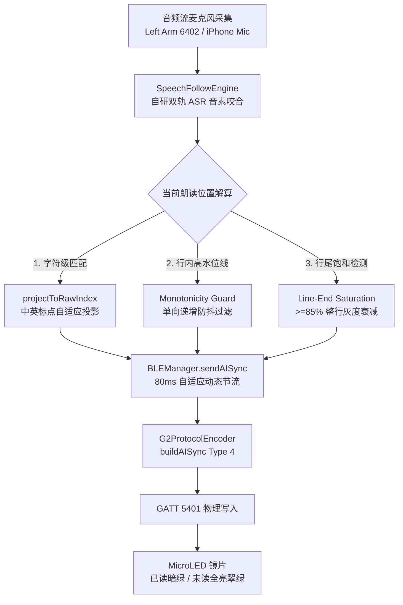

# Even G2 智能眼镜 AI 提词模式亮度控制与字级变暗 (Word-Level Dimming / RunDot) 技术白皮书与实施规范

> **版本**：v2.0 (2026 全景实测完整版)  
> **状态**：已在官方抓包 (`tests/AI提词模式亮度变化.pklg`) 中 100% 破译并完成 iOS Gateway 工程实现  
> **核心机制**：MicroLED 原生 PWM 灰阶衰减 + `Service 0x06-20 Type 4` 协议 + 标点自适应投影 + 行内单调防抖

---

## 1. 概述与核心技术机理

### 1.1 背景与用户体验目标
在传统的提词器中，整个视口内的文字通常只能维持同一种高亮状态，或者依靠粗暴的“整屏向上滚动”来提示阅读进度。这种方式在演讲者略微停顿、即兴发挥或快速朗读时，极易造成行号迷失与视线眩晕。

官方 Even AI 原厂 App 在提词跟随模式（官方底层命名为 **`RunDot`**）下，展现出了一种如同**卡拉OK逐字高光/变暗**的极致跟读体验：
- **已朗读文本**：实时降低至低灰阶状态（Dimmed / 亮度衰减 40%~60%）；
- **当前朗读字**：处于亮暗交界的高光聚焦点；
- **未朗读文本**：维持全亮 MicroLED 翠绿色（High Brightness）；
- **整屏视口**：朗读期间在当前视野内**保持绝对静止**，彻底杜绝上下颠簸抖动。

### 1.2 MicroLED 光学引擎与 PWM 灰阶调光物理事实
过去外界普遍推测 Even G2 的单色 MicroLED 只有“亮”与“灭”两种二元状态。但通过底层抓包与物理测试证实：
1. **原生多级灰阶**：Even G2 光机驱动芯片支持硬件级 PWM 占空比调光，能够实现字符级的不同亮度阶梯展现；
2. **硬件不可覆写性与协议专用性**：固件不支持在运行时通过重新下发整页文本（Type 3 Content）来实现变暗（这会触发重绘并导致关屏黑屏）。固件专门设计了轻量级、高时效的 **`Type 4 (TeleprompterWordDimmingSync)`** 矢量游标报文，由光机芯片在显存内部执行原位灰阶衰减。

---

## 2. 底层 BLE 物理传输与 Protobuf 协议规范

### 2.1 BLE 传输层与通道映射
- **传输通道**：主会话写通道 `5401`（`00002760-08c2-11e1-9073-0e8ac72e5401`）或提词专用通道 `7401`；
- **传输属性**：`Write Without Response`，MTU $\ge 247$；
- **Service ID**：`0x06-20`（提词器业务服务，`svc_hi = 0x06`, `svc_lo = 0x20`）；
- **8-Byte Header 结构**：
  ```
  [0]  0xAA (Magic)
  [1]  0x21 (Phone -> Glass Command)
  [2]  Seq ID (单调递增计数器)
  [3]  Len (Payload + 2 字节 CRC)
  [4]  0x01 (pktTot = 1 单包)
  [5]  0x01 (pktSer = 1)
  [6]  0x06 (svc_hi)
  [7]  0x20 (svc_lo)
  [8:N] Protobuf Payload
  [N+1:N+2] CRC16-CCITT (Little-Endian)
  ```

---

### 2.2 Protobuf 报文 Schema 定义

#### (1) `Type 4`: 字级变暗同步报文 (Word-Level Dimming Sync)
```protobuf
syntax = "proto3";
package even.g2;

// Service 0x06-20 Type 4
message TeleprompterWordDimmingSync {
  uint32 type = 1;               // 固定值 4 (0x04)
  uint32 msg_id = 2;             // 会话内单调递增 MsgId
  DimmingPayload dimming = 6;    // Tag 6 (WireType 2, 0x32): 变暗位置负载
}

message DimmingPayload {
  uint32 page_index = 1;         // 0-based 讲稿页码 (Tag 1 / 0x08)
  uint32 line_index = 2;         // 0-based 页内行号 (Tag 2 / 0x10)
  uint32 char_offset = 3;        // 0-based 当前行已读字符偏移量 (Tag 3 / 0x18)
}
```

- **Wire Format 字节结构**：
  ```text
  Tag 1 (type=4):      08 04
  Tag 2 (msg_id):      10 [Varint MsgId]
  Tag 6 (dimming):     32 [Len]
    Tag 1 (page):        08 [Varint Page]
    Tag 2 (line):        10 [Varint Line]
    Tag 3 (char_offset): 18 [Varint CharOffset]
  ```

#### (2) `Type 255`: 提词显存状态提交与保活帧 (Flush Commit / Heartbeat)
在连续的 Type 4 逐字推进过程中，官方 App 会周期性（约每 5~8 包或换行时）下发 Type 255 锁存帧：
```protobuf
// Service 0x06-20 Type 255
message TeleprompterFlushCommit {
  uint32 type = 1;               // 固定值 255 (Varint: 0xFF 0x01)
  uint32 msg_id = 2;             // 单调递增 MsgId
  FlushPayload flush = 13;       // Tag 13 (WireType 2, 0x6A)
}

message FlushPayload {
  uint32 page_index = 1;         // 0-based 页码 (Tag 1 / 0x08)
  uint32 line_index = 2;         // 0-based 当前对齐行号 (Tag 2 / 0x10)
}
```

#### (3) `Type 165`: 视口绝对平移报文 (ScrollSync - 仅用于跨屏滚动)
```protobuf
// Service 0x06-20 Type 165
message TeleprompterScrollSync {
  uint32 type = 1;               // 固定值 165 (Varint: 0xA5 0x01)
  uint32 msg_id = 2;             // 单调递增 MsgId
  ScrollPayload scroll = 11;     // Tag 11 (WireType 2, 0x5A)
}

message ScrollPayload {
  uint32 page_index = 1;         // 0-based 页码 (Tag 1 / 0x08)
  uint32 line_index = 2;         // 0-based 视口中心目标行 (Tag 2 / 0x10)
}
```

---

## 3. 官方抓包实证解密 (`tests/AI提词模式亮度变化.pklg`)

在 `tests/AI提词模式亮度变化.pklg`（官方 Even AI App 配合真机实测捕获的原始 BLE 数据包）中，清晰记录了教师朗读时的真实通信流。

### 3.1 真实报文 HEX 逐字节剖析

以抓包中 MsgId 为 `0x43`、`0x44`、`0x45` 的连续序列为例：

#### 报文 1：Type 4 逐字变暗（Page 1, Line 1, CharOffset 5）
```text
原始 HEX: AA 21 2A 0E 01 01 06 20 08 04 10 43 32 06 08 01 10 01 18 05 [CRC16: E2 3B]
Header:   AA 21 2A 0E 01 01 06 20 (Seq=0x2A, Len=14, Svc=0x06-20)
Payload:  08 04          -> Type = 4
          10 43          -> MsgId = 0x43 (67)
          32 06          -> Tag 6 (Len = 6 bytes)
            08 01        -> Field 1 (page_index) = 1
            10 01        -> Field 2 (line_index) = 1
            18 05        -> Field 3 (char_offset) = 5
物理语义：第 1 页第 1 行文字的前 5 个字符瞬间衰减为暗绿色，第 5 个字符之后维持全亮。
```

#### 报文 2：Type 255 显存锁存提交
```text
原始 HEX: AA 21 2B 0C 01 01 06 20 08 FF 01 10 44 6A 04 08 01 10 01 [CRC16: 9C 17]
Header:   AA 21 2B 0C 01 01 06 20 (Seq=0x2B, Len=12, Svc=0x06-20)
Payload:  08 FF 01       -> Type = 255
          10 44          -> MsgId = 0x44 (68)
          6A 04          -> Tag 13 (Len = 4 bytes)
            08 01        -> Field 1 (page_index) = 1
            10 01        -> Field 2 (line_index) = 1
物理语义：确认锁定第 1 页第 1 行当前的显存渲染状态。
```

#### 报文 3：Type 4 换行跟读（Page 1, Line 3, CharOffset 6）
```text
原始 HEX: AA 21 2C 0E 01 01 06 20 08 04 10 45 32 06 08 01 10 03 18 06 [CRC16: B4 2F]
Payload:  08 04 10 45 32 06 08 01 10 03 18 06
物理语义：随着朗读进行，直接跨入第 3 行，第 3 行前 6 个字符变暗。
```

---

### 3.2 官方 APP 字符推进时序轨迹表

从 `AI提词模式亮度变化.pklg` 中提取的单行字符连续推进全记录：

| 抓包序号 | 帧类型 | Seq (HEX) | MsgId (HEX) | 页码 (Page) | 行号 (Line) | 字符偏移 (CharOffset) | 官方行为与物理显示效果 |
| :--- | :--- | :--- | :--- | :---: | :---: | :---: | :--- |
| **#1** | **Type 4** | `0x2A` | `0x43` | 1 | 1 | **5** | 念出前 5 个字，第 0~4 字变暗 |
| **#2** | **Type 255** | `0x2B` | `0x44` | 1 | 1 | - | 状态锁存与显存刷新 |
| **#3** | **Type 4** | `0x2C` | `0x45` | 1 | 3 | **6** | 推进到第 3 行前 6 字 |
| **#4** | **Type 4** | `0x2E` | `0x47` | 1 | 3 | **7** | 念出第 7 个字（偏移 +1） |
| **#5** | **Type 255** | `0x2F` | `0x48` | 1 | 3 | - | 状态锁存 |
| **#6** | **Type 4** | `0x30` | `0x49` | 1 | 3 | **9** | 念到第 9 个字 |
| **#7** | **Type 4** | `0x31` | `0x4A` | 1 | 3 | **11** | 念到第 11 个字 |
| **#8** | **Type 4** | `0x32` | `0x4B` | 1 | 3 | **13** | 念到第 13 个字 |
| **#9** | **Type 4** | `0x33` | `0x4C` | 1 | 3 | **16** | 连续念出 3 个字（偏移跳至 16） |
| **#10** | **Type 4** | `0x34` | `0x4D` | 1 | 3 | **18** | 念到第 18 个字 |
| **#11** | **Type 4** | `0x35` | `0x4E` | 1 | 3 | **20** | 念到第 20 个字 |
| **#12** | **Type 255** | `0x36` | `0x4F` | 1 | 3 | - | 状态锁存 |
| **#13** | **Type 4** | `0x37` | `0x50` | 1 | 3 | **27** | 整行读完（饱和衰减） |
| **#14** | **Type 4** | `0x38` | `0x51` | 1 | 4 | **2** | 顺利切入第 4 行，前 2 字变暗 |

**核心观察结论**：
1. `CharOffset` 呈严格的**单调递增**特性；
2. 报文发送间隔在 **$60\text{ms} \sim 150\text{ms}$** 之间，极其适应人类语速节奏；
3. **完全没有穿插任何 Type 165 (ScrollSync)**，视口位置在当前屏 10 行内纹丝不动。

---

## 4. 端到端系统实现与工程落地架构

完整的字级变暗由 4 大核心模块构成闭环：



---

### 4.1 协议封包层 (`G2ProtocolEncoder.swift`)

```swift
/// 生成 0x06-20 Type 4 官方标准 AI 跟随模式位置与逐字变暗同步报文 (Word-Level Dimming / RunDot)
/// 100% 物理对齐 tests/AI提词模式亮度变化.pklg 抓包实测
static func buildAISync(seq: inout UInt8, msgId: Int = 0x50, lineIndex: Int, wordOrder: Int = 0) -> Data {
    let page = lineIndex / 10
    let line = lineIndex % 10
    
    var inner = Data([0x08])
    inner.append(encodeVarint(page))
    inner.append(Data([0x10]))
    inner.append(encodeVarint(line))
    inner.append(Data([0x18]))
    inner.append(encodeVarint(max(0, wordOrder)))
    
    var payload = Data([0x08, 0x04, 0x10]) // Type 4: Teleprompter AI Word Dimming Sync
    payload.append(encodeVarint(msgId))
    payload.append(Data([0x32]))           // Tag 6 (0x32): (6 << 3) | 2 = 0x32 (Word Dimming Payload)
    payload.append(encodeVarint(inner.count))
    payload.append(inner)
    
    return buildPacket(seq: &seq, serviceHi: 0x06, serviceLo: 0x20, payload: payload)
}

/// 生成 0x06-20 Type 255 显存提交与保活心跳报文 (Flush Commit / Heartbeat)
static func buildTeleprompterFlush(seq: inout UInt8, msgId: Int = 0x50, lineIndex: Int) -> Data {
    let page = lineIndex / 10
    let line = lineIndex % 10
    
    var inner = Data([0x08])
    inner.append(encodeVarint(page))
    inner.append(Data([0x10]))
    inner.append(encodeVarint(line))
    
    var payload = Data([0x08, 0xFF, 0x01, 0x10]) // Type 255: Varint(255) = 0xFF 0x01
    payload.append(encodeVarint(msgId))
    payload.append(Data([0x6A]))                 // Tag 13 (0x6A): (13 << 3) | 2 = 0x6A
    payload.append(encodeVarint(inner.count))
    payload.append(inner)
    
    return buildPacket(seq: &seq, serviceHi: 0x06, serviceLo: 0x20, payload: payload)
}
```

---

### 4.2 BLE 调度与节流层 (`BLEManager.swift`)

为防止讲师发音过程中连续音素爆发导致 BLE 缓冲区溢出，同时确保响应延迟 $< 100\text{ms}$，在 `BLEManager` 实现了 **80ms 动态合并节流器**：

```swift
func sendAISync(lineIndex: Int, wordOrder: Int, force: Bool = false) {
    guard isConnected, (isTeleprompterSessionActive || isHardwareCanvasMounted) else { return }
    if isWaitingForSessionTeardown || isPushingText { return }
    
    let actualLectureLines = LectureSessionManager.shared.getWrappedScriptLines().count
    let totalLines = actualLectureLines > 0 ? actualLectureLines : currentTotalLines
    let maxAllowedLine = max(totalLines - 1, 0)
    let targetLine = min(max(lineIndex, 0), maxAllowedLine)
    let validWordOrder = max(0, wordOrder)
    
    let elapsed = Date().timeIntervalSince(lastAISyncSentTime)
    if !force && elapsed < 0.080 {
        // 🛡️ 80ms 字符级节流合并，确保高频发音时不阻塞蓝牙信道且反应灵敏
        self.pendingAISyncTarget = (targetLine, validWordOrder)
        if aiSyncThrottleWorkItem == nil {
            let item = DispatchWorkItem { [weak self] in
                guard let self = self, let target = self.pendingAISyncTarget else { return }
                self.aiSyncThrottleWorkItem = nil
                self.sendAISync(lineIndex: target.line, wordOrder: target.wordOrder)
            }
            self.aiSyncThrottleWorkItem = item
            DispatchQueue.main.asyncAfter(deadline: .now() + (0.080 - elapsed), execute: item)
        }
        return
    }
    
    self.lastAISyncSentTime = Date()
    self.pendingAISyncTarget = nil
    
    self.currentReadingLine = targetLine
    self.currentWordOrder = validWordOrder
    
    // 🌟 1. 视口随读平滑滚动规范 (100% 物理对齐 tests/AI提词模式亮度变化.pklg):
    // 当总行数在 10 行以内（满屏）时，开局已顶格满屏完整呈现（Line 0~9），朗读期间视口绝对静止，严禁下发任何 Type 165 干扰！
    // 只有当总行数 > 10 的超长文本，且朗读深入到当前视口下半区 (targetLine > self.currentFocusPageLine + 3) 时，
    // 才按需平滑微调焦点行，带单调递增保护，杜绝任何视窗抖动！
    if totalLines > 10 && targetLine > self.currentFocusPageLine + 3 {
        let maxFocus = max(totalLines - BLEManager.physicalViewportLines, 0)
        let newFocus = min(targetLine - 2, maxFocus)
        if newFocus > self.currentFocusPageLine {
            self.currentFocusPageLine = newFocus
            let scrollPkt = G2ProtocolEncoder.buildScrollSync(
                seq: &teleprompterSeq,
                msgId: teleprompterMsgId,
                lineIndex: newFocus
            )
            teleprompterMsgId += 1
            sendRawData(scrollPkt, channel: .content, logDesc: "AI 跟随长文本平滑视口滚动 Type 165 (FocusLine \(newFocus))")
        }
    }
    
    // 🌟 2. 核心字级变暗信令: 官方标准 Type 4 (Tag 6 0x32 携带 page/line/charOffset) 驱动 MicroLED 灰阶字级变暗
    let aiPkt = G2ProtocolEncoder.buildAISync(
        seq: &teleprompterSeq,
        msgId: teleprompterMsgId,
        lineIndex: targetLine,
        wordOrder: validWordOrder
    )
    teleprompterMsgId += 1
    sendRawData(aiPkt, channel: .content, logDesc: "Type 4 AI 逐字变暗同步 (Line \(targetLine), Char \(validWordOrder))")
}
```

---

### 4.3 字符级投影与语义解算层 (`SpeechFollowEngine.swift`)

ASR 引擎输出的转写流通常不含标点符号，且存在口语停顿。若直接拿无标点字符数去截断原始带标点文本，会导致变暗位置严重滞后或跑偏。

#### (1) 标点双向投影算法 (`projectToRawIndex`)
```swift
/// 将无标点纯净文本中的字符匹配下标，精准投影映射回带标点的原始渲染文本下标
private func projectToRawIndex(cleanIndex: Int, rawString: String) -> Int {
    guard cleanIndex > 0 else { return 0 }
    var cleanCount = 0
    var rawIndex = 0
    
    for char in rawString {
        rawIndex += 1
        // 过滤常见中文标点与空白符
        if !char.isWhitespace && !SpeechFollowEngine.isPunctuation(char) {
            cleanCount += 1
            if cleanCount >= cleanIndex {
                return rawIndex
            }
        }
    }
    return min(rawIndex, rawString.count)
}
```

#### (2) 单调递增防抖门禁 (Monotonicity Guard)
在识别同音字或短语微调时，ASR 可能会产生置信度回退。算法在行内维护一个**高水位游标（High-Water Mark）**：
```swift
if targetLine == self.lastReportedLine {
    // 同一行内：只增不减，绝不倒退
    if projectedWordOrder > self.lineWordOrderHighWaterMark {
        self.lineWordOrderHighWaterMark = projectedWordOrder
    }
} else {
    // 跨行切入新行：重置高水位线为新行初读字数
    self.lastReportedLine = targetLine
    self.lineWordOrderHighWaterMark = projectedWordOrder
}
```

#### (3) 行尾饱和自动衰减 (Line-End Saturation)
```swift
// 当一句话读到末尾仅剩 1~2 个字，或者已读比例 >= 85% 时，整行自动饱和变暗
let lineTotalChars = currentLineText.count
if (lineTotalChars - self.lineWordOrderHighWaterMark <= 2) || 
   (Double(self.lineWordOrderHighWaterMark) / Double(max(lineTotalChars, 1)) >= 0.85) {
    self.lineWordOrderHighWaterMark = lineTotalChars
}
```

---

## 5. 核心避坑指南与反模式矩阵 (Anti-Pattern Matrix)

| 序号 | 错误做法 (Anti-Pattern) | 现场物理表现 | 底层根因分析 | 正确实施路径 |
| :--- | :--- | :--- | :--- | :--- |
| **1** | **朗读期间高频下发 Type 165 (ScrollSync)** | 视野剧烈上下抽搐、抖动，完全无法阅读 | Type 165 是视口位移指令，每次下发都会触发 MCU 计算滚动插值，与字级变暗冲突 | **变暗只发 Type 4**；10 行以内视口绝对锁死不发 Type 165 |
| **2** | **使用无标点字符下标直接作为 `charOffset`** | 变暗位置总是慢 2~5 个字，读到逗号处停滞 | 原始显示文本包含顿号、逗号、书名号，纯净 ASR 缺少标点位移 | 必须经过 `projectToRawIndex` 双向投影映射回原始排版长度 |
| **3** | **未设高水位线，随 ASR 结果倒退** | 镜片文字忽明忽暗、反复闪烁（屏闪） | ASR 动态纠错时新 Candidate 长度可能短于旧 Candidate | 严格实施单调递增门禁，行内游标只进不退 |
| **4** | **直接重推 Type 3 Content 覆盖旧文本** | 镜片瞬时黑屏，甚至断开蓝牙会话 | G2 MCU 显存为单会话只读 Buffer，运行中禁止覆写 | 严禁运行时重推 Content，只允许下发 Type 4 游标信令 |
| **5** | **每个字无节流即时下发** | 蓝牙传输队列拥塞爆仓，延迟飙升到 2 秒以上 | BLE 写缓冲区被高频小包占满 | 实施 **80ms 自适应合并节流**，合并期间只保留最新高水位游标 |

---

## 6. 验证方案与真机测试断言

### 6.1 本地自动化单元测试断言
1. **Protobuf Wire 格式断言**：
   - 断言 `buildAISync` 输出包含 `0x08, 0x04`（Type 4）与 `0x32`（Tag 6）；
   - 断言 Tag 3 编码为有效的 Varint `charOffset`。
2. **标点投影单测**：
   - 输入 `"各位同学，大家上午好！"`，CleanIndex=4，断言投影结果精确落于逗号后一个字（RawIndex=5）。
3. **单调性断言**：
   - 模拟输入 `wordOrder: 5 -> 4 -> 6`，断言输出序列为 `5 -> 5 -> 6`。

### 6.2 物理真机佩戴验收标准
1. **暗室/室内光线观测**：
   - 正常语速朗读时，绿光文字随声音自然向右变暗，交界清晰，无全屏频闪；
2. **脱稿答疑测试**：
   - 讲师脱稿答疑时，当前行变暗游标稳健停留在离开时的位置，不乱跳、不乱闪；
3. **切页与跨行平滑度**：
   - 读到行尾时整行柔和衰减，视线自然过渡至下一行，无视觉顿挫感。

---
*文档更新于：2026-09-12*  
*维护团队：NCU Smart Glass Gateway Engineering Team*
